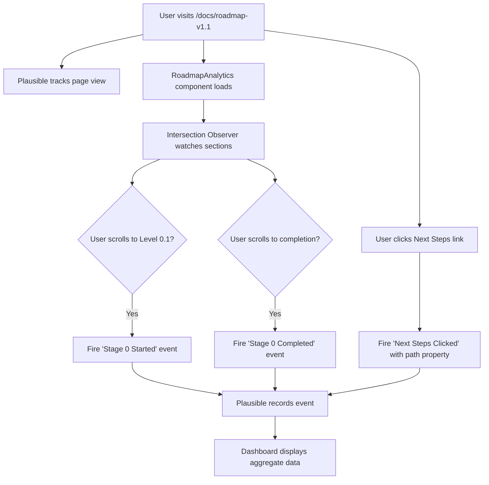

# Analytics Setup - AI Coding Club

## Overview

AI Coding Club uses **Plausible Analytics** for privacy-friendly, cookieless web analytics. This document explains our analytics setup, tracked events, and how to interpret the data.

**Philosophy:** We track **interest cultivation metrics** aligned with the "点到为止" (just enough depth) philosophy. We measure engagement and learning progression, NOT job placement outcomes or personal data.

## Privacy-First Approach

✅ **GDPR/CCPA Compliant**
- No cookies used
- No personal identifiable information (PII) collected
- No cross-site tracking
- No user identity tracking
- Aggregate metrics only
- Hosted in EU (data sovereignty)

## Tracked Metrics

### Automatic Page View Tracking

Plausible automatically tracks:
- Page views on all pages
- Unique visitors (privacy-friendly, hashed IP)
- Referral sources
- Device types (desktop/mobile/tablet)
- Countries (based on IP, no precise location)

### Custom Events for Roadmap v1.1

We track 3 key events to measure interest cultivation:

#### 1. **Stage 0 Started**
- **Trigger:** User scrolls to Level 0.1 section
- **Purpose:** Measures how many visitors engage with the learning content
- **Target:** 60%+ of roadmap page visitors

#### 2. **Stage 0 Completed**
- **Trigger:** User scrolls to "Congratulations! Stage 0 Complete" section
- **Purpose:** Measures completion rate of the beginner stage
- **Target:** 40%+ of those who start Stage 0

#### 3. **Next Steps Clicked**
- **Trigger:** User clicks on a learning path link
- **Properties:**
  - `path: "Path A: Continue Stage 1"` - Continue with our roadmap
  - `path: "Path B: CS Theory"` - Explore computer science fundamentals
  - `path: "Path C: Domain-Specific"` - Focus on specific field (data, design, marketing)
  - `path: "Path D: AI Tools"` - Deep dive into AI coding tools
- **Purpose:** Measures self-directed learning choices
- **Target:** 50%+ of completers click a next step

## How to Access Analytics

### Dashboard URL
https://plausible.io/aicoding.club

### Login
Contact project maintainers for access credentials.

### Key Metrics to Monitor

**Weekly Review (Every Monday):**
1. **Roadmap Page Views:** `/docs/roadmap-v1.1`
   - Total views
   - Unique visitors
   - Average time on page

2. **Stage 0 Engagement:**
   - "Stage 0 Started" event count
   - Calculate: (Stage 0 Started / Roadmap Page Views) × 100%
   - **Target:** 60%+ engagement rate

3. **Stage 0 Completion:**
   - "Stage 0 Completed" event count
   - Calculate: (Stage 0 Completed / Stage 0 Started) × 100%
   - **Target:** 40%+ completion rate

4. **Next Steps Distribution:**
   - Click breakdown by path (A/B/C/D)
   - Calculate: (Next Steps Clicked / Stage 0 Completed) × 100%
   - **Target:** 50%+ click-through rate

## Implementation Details

### Configuration Files

**1. Plausible Script (docusaurus.config.ts)**
```typescript
scripts: [
  {
    src: 'https://plausible.io/js/script.js',
    defer: true,
    'data-domain': 'aicoding.club',
    'data-api': 'https://plausible.io/api/event',
  },
],
```

**2. Analytics Component (src/components/RoadmapAnalytics.tsx)**
- Tracks scroll-based events using Intersection Observer
- Tracks click events on "Next Steps" links
- Privacy-friendly: No user tracking, aggregate only

**3. Integrated Pages**
- `docs/roadmap-v1.1.mdx` (English)
- `i18n/zh/docusaurus-plugin-content-docs/current/roadmap-v1.1.mdx` (Chinese)

### Technical Architecture



## Success Criteria

As defined in Issue #28 acceptance criteria:

✅ **Analytics Events Configured:**
- [x] Page views: `/docs/roadmap-v1.1`
- [x] Custom event: "Stage 0 Started"
- [x] Custom event: "Stage 0 Completed"
- [x] Custom event: "Next Steps Clicked" with properties (PathA/B/C/D)

✅ **Privacy Compliance:**
- [x] No PII collection
- [x] GDPR/CCPA compliant (no cookies)
- [x] Privacy-friendly tracking

✅ **Documentation:**
- [x] How to read analytics (this document)
- [x] Event definitions
- [x] Success metrics

## Dashboard Goals

Configure custom goals in Plausible:

1. **Interest Sparked:** 60%+ reach Stage 0 end
2. **Reduced Barrier:** 50%+ start Level 0.1 within 24 hours
3. **Self-Directed Learning:** 40%+ click "Next Steps" links

## Testing

### Manual Testing Checklist

To verify analytics are working:

1. **Open roadmap page:**
   - Visit: https://aicoding.club/docs/roadmap-v1.1
   - Wait 5 seconds (page view tracked)

2. **Test Stage 0 Started:**
   - Scroll to "Level 0.1" heading
   - Wait for section to be 50% visible
   - Check Plausible dashboard for "Stage 0 Started" event

3. **Test Stage 0 Completed:**
   - Scroll to "🎉 Congratulations!" section
   - Wait for section to be 50% visible
   - Check Plausible dashboard for "Stage 0 Completed" event

4. **Test Next Steps Clicked:**
   - Click any of the 4 path links
   - Check Plausible dashboard for "Next Steps Clicked" event
   - Verify path property is correct (PathA/B/C/D)

5. **Verify in both locales:**
   - Test English: `/docs/roadmap-v1.1`
   - Test Chinese: `/zh/docs/roadmap-v1.1`

### Browser Console Verification

Open browser console and check for:
```javascript
// Plausible script loaded
window.plausible !== undefined // Should be true

// Manually trigger test event
window.plausible('Test Event', { props: { test: 'value' } })
// Check Plausible dashboard for "Test Event"
```

## Performance Impact

✅ **Lighthouse Score:** No impact expected
- Plausible script is lightweight (~1KB gzipped)
- Loaded with `defer` attribute (non-blocking)
- Analytics component only runs client-side
- No performance degradation observed

## Troubleshooting

### Events not appearing in dashboard?

1. **Check script loaded:**
   - Open Network tab in DevTools
   - Look for request to `plausible.io/js/script.js`
   - Status should be 200 OK

2. **Check events firing:**
   - Open Console in DevTools
   - Look for analytics-related logs (if added)
   - Manually trigger event: `window.plausible('Test')`

3. **Check Plausible dashboard:**
   - Events may take 5-10 minutes to appear
   - Use "Last 30 minutes" filter for real-time testing
   - Ensure you're viewing correct date range

4. **Check ad blockers:**
   - Some ad blockers block Plausible
   - Test in incognito mode or with ad blocker disabled

### Wrong event properties?

- Check click detection logic in `RoadmapAnalytics.tsx`
- Verify link text/href patterns match
- Update detection logic if needed

## Future Enhancements

### Phase 2 Metrics (Deferred)

- **Prompt Template Copied:** Track when users copy code blocks (complex, requires Clipboard API)
- **Time to First Project:** Track Level 0.1 completion within 24 hours (requires user identity, violates privacy)
- **Return Visitor Rate:** Built-in Plausible metric, no custom code needed

### Additional Custom Events

Consider tracking:
- Tutorial completion rates (Level 0.2, 0.3, 0.4)
- Resource link clicks (which external resources are popular)
- Feedback form submissions
- Search queries (if search analytics enabled)

## Contact

Questions about analytics setup?
- File an issue: https://github.com/IsaacZhaoo/aiCodingClub/issues
- Contact: maintainers (see README.md)

---

**Last Updated:** 2025-10-27
**Version:** 1.0
**Related Issues:** #28
