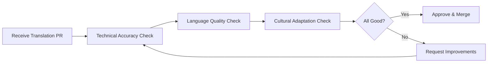

# Translation Contribution Guide

## 🌍 Help Make AI Education Accessible Globally

Thank you for your interest in translating AI Coding Club content! Your contribution helps learners worldwide access quality AI programming education in their native language.

## 📋 Available Languages

| Language | Status | Community Lead | Contributors | Join |
|----------|--------|----------------|--------------|------|
| English | ✅ Active | @IsaacZhaoo | - | Base language |
| 中文 | ✅ Active | @IsaacZhaoo | - | Active |
| Español | 🔜 Planned | **Needed** | 0 | [Apply](#how-to-become-a-language-lead) |
| Português | 🔜 Planned | **Needed** | 0 | [Apply](#how-to-become-a-language-lead) |
| हिन्दी | 🔜 Planned | **Needed** | 0 | [Apply](#how-to-become-a-language-lead) |
| 日本語 | 🔜 Planned | **Needed** | 0 | [Apply](#how-to-become-a-language-lead) |
| العربية | 🔜 Planned | **Needed** | 0 | [Apply](#how-to-become-a-language-lead) |
| Français | 🔜 Planned | **Needed** | 0 | [Apply](#how-to-become-a-language-lead) |

## 🎯 What You'll Translate

### Content Types (Priority Order)

1. **Core Documentation** (~10 pages)
   - AI Coding Roadmap
   - Getting Started guides
   - Prompt Engineering basics

2. **Tutorials** (~20 pages)
   - Step-by-step coding tutorials
   - Tool comparisons
   - Best practices

3. **Blog Posts** (ongoing)
   - Weekly articles
   - Case studies
   - News updates

4. **UI Elements**
   - Navigation menus
   - Buttons and labels
   - Error messages

## 🚀 How to Contribute

### Option 1: Quick Translation (For Occasional Contributors)

**Perfect for**: Translating 1-2 pages

1. **Find content to translate**
   - Check [Translation Requests](https://github.com/IsaacZhaoo/aicodingclub/issues?q=is%3Aissue+is%3Aopen+label%3Atranslation)
   - Look for `[TRANSLATION NEEDED]` tag

2. **Use AI-assisted translation**
   ```bash
   # We provide a translation prompt template
   # See "AI Translation Prompt" section below
   ```

3. **Submit via PR**
   - Fork repository
   - Create `filename.{lang}.md` (e.g., `tutorial.es.md`)
   - Submit pull request
   - Tag language lead for review

### Option 2: Become a Language Lead (For Committed Contributors)

**Perfect for**: Managing an entire language version

**Requirements**:
- ✅ Native speaker of target language
- ✅ Fluent in English (reading technical docs)
- ✅ Basic understanding of AI/programming
- ✅ Can commit 3-5 hours/week
- ✅ Passionate about education accessibility

**Benefits**:
- 🏆 Official "Language Lead" badge
- 💰 Revenue sharing (20% of paid subscriptions from your language)
- 📢 Your profile featured on website
- 🌟 Build your personal brand
- 🤝 Direct collaboration with founder

**Responsibilities**:
1. Translate core documentation (initial)
2. Review community translations (ongoing)
3. Maintain translation quality
4. Recruit local contributors
5. Adapt content culturally (not just word-for-word)

**How to Apply**:
1. Open a [Discussion](https://github.com/IsaacZhaoo/aicodingclub/discussions/new?category=general)
2. Title: `[Language Lead Application] - {Your Language}`
3. Include:
   - Your language proficiency
   - Technical background
   - Sample translation (translate our [homepage](/) to your language)
   - Availability (hours/week)
   - Motivation

## 📝 Translation Standards

### Technical Terms: Keep or Translate?

#### ✅ Keep in English (with first-mention explanation)

```markdown
# English
Learn Prompt Engineering techniques...

# Spanish
Aprende técnicas de Prompt Engineering (ingeniería de instrucciones)...
```

**Terms to keep**:
- Prompt Engineering
- AI Coding
- GitHub Copilot
- Claude / ChatGPT / GPT-4
- API, JSON, HTML, CSS
- Large Language Model (LLM)

#### ✅ Translate Completely

```markdown
# English
Step-by-step tutorial

# Spanish
Tutorial paso a paso
```

**Terms to translate**:
- Tutorial → (target language word for tutorial)
- Example → (target language)
- Prerequisites → (target language)
- Code → (target language)

### Code Examples: Never Translate

```python
# ✅ CORRECT - Keep code and comments in English
def generate_prompt(task: str) -> str:
    """Generate AI prompt for coding task."""
    return f"Write code to {task}"

# ❌ WRONG - Don't translate code
def generar_prompt(tarea: str) -> str:
    """Generar prompt AI para tarea de codificación."""
    return f"Escribe código para {tarea}"
```

**Exception**: You may add translated comments BELOW English comments:
```python
# Generate AI prompt for coding task
# Generar prompt de IA para tarea de programación
```

### Cultural Adaptation

**Don't just translate words - adapt the meaning!**

#### Example 1: Idioms
```markdown
# English
"Like learning to ride a bike, AI coding gets easier with practice."

# Spanish (literal translation - BAD)
"Como aprender a montar en bicicleta, la codificación con IA se vuelve más fácil con la práctica."

# Spanish (culturally adapted - GOOD)
"Como aprender a tocar la guitarra, la codificación con IA mejora con la práctica."
(In Spain/Latin America, guitar is more universal than bike riding)
```

#### Example 2: Examples and Scenarios
```markdown
# English
"Build a to-do app for managing your busy schedule"

# Hindi (adapted to local context)
"भारत में ऑनलाइन किराना डिलीवरी ऐप बनाएं"
(Build an online grocery delivery app in India)
```

## 🤖 AI Translation Prompt Template

**Copy this prompt and use with Claude/GPT-4**:

````
You are a professional translator specializing in technical documentation about AI and programming.

**Task**: Translate the following English content to {TARGET_LANGUAGE}.

**Context**: This is educational content teaching people how to code with AI assistance. Target audience: beginners to intermediate programmers.

**Translation Guidelines**:
1. **Technical Terms**:
   - Keep these in English with explanation in parentheses on first use: "Prompt Engineering", "AI Coding", "GitHub Copilot", "Claude", "GPT-4", "API", "JSON"
   - Translate these completely: "tutorial", "example", "step", "code", "function"

2. **Code Examples**:
   - Never translate code itself
   - Keep variable names in English
   - Keep comments in English (you may add translated comment below)

3. **Cultural Adaptation**:
   - Adapt examples to local context (e.g., local apps, local scenarios)
   - Adapt idioms and metaphors to be culturally relevant
   - Keep the same meaning and depth of information

4. **Formatting**:
   - Preserve all markdown formatting
   - Keep all links unchanged
   - Maintain the same structure (headings, lists, code blocks)

5. **Style**:
   - Write naturally in {TARGET_LANGUAGE} (not literal translation)
   - Maintain friendly, educational tone
   - Use "you" form (informal, friendly)

**Source Text**:
```
[PASTE ENGLISH CONTENT HERE]
```

**Output**: Only the translated text in {TARGET_LANGUAGE}, maintaining all markdown formatting.
````

## 📊 Translation Workflow

### For Contributors

```mermaid
graph LR
    A[Pick Untranslated Content] --> B[Translate Using AI + Manual Review]
    B --> C[Create .{lang}.md File]
    C --> D[Submit Pull Request]
    D --> E[Language Lead Reviews]
    E --> F{Approved?}
    F -->|Yes| G[Merged & Published]
    F -->|No| H[Request Changes]
    H --> B
```

### For Language Leads



## 🏆 Recognition & Rewards

### All Contributors
- ✅ Listed in `CONTRIBUTORS.md`
- ✅ GitHub contributor badge
- ✅ Mentioned in release notes
- ✅ Portfolio/resume material

### Language Leads
- 🌟 Featured profile on website
- 💰 20% revenue share from your language subscribers
- 📊 Access to language-specific analytics
- 🎤 Opportunity to speak at events (if desired)
- 📈 Help grow AI education in your region

### Top Contributors (Most pages translated)
- 🏅 "Top Translator" badge
- 🎁 Swag (t-shirt, stickers)
- 💬 1-on-1 mentorship session with founder
- 📚 Free access to all paid content

## 📞 Getting Help

### Questions About Translation
- Open a [Discussion](https://github.com/IsaacZhaoo/aicodingclub/discussions)
- Tag your language lead (if available)
- Join Discord `#translation` channel

### Technical Issues
- Check [Translation FAQ](https://github.com/IsaacZhaoo/aicodingclub/wiki/Translation-FAQ)
- Ask in `#tech-support` on Discord

### Terminology Questions
- Refer to glossary in CONTENT_WORKFLOW.md (Section: Terminology Guidelines)
- Ask in `#translation` channel
- Suggest new terms via Discussion

## 🎓 Translation Best Practices

### DO ✅
- Use AI assistance (Claude, GPT-4, DeepL)
- Review and edit AI translations
- Test links and formatting
- Ask questions when unsure
- Adapt culturally, not just linguistically
- Keep technical terms in English
- Maintain markdown formatting

### DON'T ❌
- Use Google Translate alone (low quality)
- Translate code or variable names
- Change the meaning or depth of content
- Add or remove information
- Translate without understanding the content
- Submit without reviewing

## 📅 Translation Priority

### Phase 1: Core Pages (Weeks 1-2)
1. Homepage
2. AI Coding Roadmap
3. Getting Started guide
4. Navigation menus

### Phase 2: Essential Tutorials (Weeks 3-6)
1. Top 5 most-viewed tutorials
2. Prompt Engineering basics
3. Tool comparison guides

### Phase 3: Ongoing Content (Week 7+)
1. New blog posts (as published)
2. Remaining tutorials
3. Resources page
4. Community guidelines

## 🌟 Success Stories

> "I translated AI Coding Club to Spanish and now I'm the language lead for all Spanish content. I've helped thousands of learners in Latin America access AI education, and I earn passive income from subscriptions. It's incredibly fulfilling!" - Maria G., Spain

> "Contributing translations improved my technical English and gave me portfolio material that helped me land a job at a tech company." - Raj S., India

## 🚀 Ready to Start?

1. **Quick contribution**: Browse [Translation Requests](https://github.com/IsaacZhaoo/aicodingclub/issues?q=is%3Aissue+is%3Aopen+label%3Atranslation)
2. **Become language lead**: [Apply here](https://github.com/IsaacZhaoo/aicodingclub/discussions/new?category=general)
3. **Questions first**: [Ask in Discussions](https://github.com/IsaacZhaoo/aicodingclub/discussions)

---

**Together, we can make AI education accessible to everyone, everywhere.** 🌍
