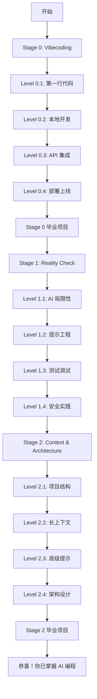

# AI Coding Club - Learning Roadmap Structure
## Content Structure Design (v1.0)

> 基于现有 Stage 0/1/2，设计"关卡"（Levels）细分结构
> 每个关卡 = 明确目标 + 实战项目 + 推荐工具 + 学习资源

---

## 🎮 Stage 0: Vibecoding
**核心目标：** 消除恐惧，今天就开始编程
**预计时长：** 2-4 周（每天 1-2 小时）

### Level 0.1: 第一行代码（First Code）
**学习目标：**
- 体验 AI 辅助编程的魔力
- 无需配置，立即开始
- 建立信心：我也能写代码！

**实战项目：**
- 在线构建：简单的个人介绍页面（HTML + CSS）
- 平台：Replit 或 CodePen（浏览器直接运行，零配置）

**推荐工具：**
- **Replit AI**（免费）- 在线 IDE，内置 AI 助手
- **ChatGPT**（免费层）- 解释代码、回答问题
- 备选：V0.dev（生成 UI 组件）

**学习资源（现有）：**
- [Replit: Build with AI Tutorial](https://replit.com/learn)
- [Fireship: 10 web apps with AI (14 min)](https://www.youtube.com/watch?v=UG3YC_jqPDg)

**检查点：**
- ✅ 发布了自己的第一个网页（可访问的 URL）
- ✅ 使用 AI 修改了代码并看到了效果
- ✅ 能用自然语言描述想要的功能

---

### Level 0.2: 安装工具，本地开发（Setup Local Environment）
**学习目标：**
- 安装本地开发环境
- 理解文件、文件夹、编辑器的概念
- 使用专业工具（但保持简单）

**实战项目：**
- 在本地构建：待办事项应用（To-Do List）
- 涉及：HTML, CSS, JavaScript 基础，数据持久化（localStorage）

**推荐工具：**
- **Cursor**（免费层）- AI 编辑器，对初学者最友好
- **VS Code + GitHub Copilot**（备选）
- **Git + GitHub**（版本控制入门）

**学习资源（现有）：**
- [Cursor IDE Tutorial for Beginners (25 min)](https://www.youtube.com/watch?v=4q0ekTZqZZM)
- [Build a Todo App with AI (30 min)](https://www.youtube.com/watch?v=NgX5qxSwUFg)
- [Cursor Quickstart Guide](https://docs.cursor.com/get-started/migrate-from-vscode)

**检查点：**
- ✅ Cursor 或 VS Code 已安装并能运行
- ✅ 完成待办事项应用，能添加/删除任务
- ✅ 代码已提交到 GitHub（版本控制初体验）

---

### Level 0.3: API 与后端初探（First API Integration）
**学习目标：**
- 理解前端与后端的关系
- 学会调用第三方 API
- 处理异步操作（async/await）

**实战项目：**
- 构建：天气查询应用 / Discord Bot / Chrome 扩展（任选一）
- 涉及：API 调用、数据处理、错误处理

**推荐工具：**
- **Cursor + AI Chat**（解释 API 文档）
- **Postman / Thunder Client**（测试 API）
- **免费 API 资源：** OpenWeatherMap, Discord API, Chrome Extensions API

**学习资源（现有）：**
- [Create Your First Discord Bot with AI (20 min)](https://www.youtube.com/watch?v=hoDLj0IzZMU)
- [ChatGPT for Coding: Complete Guide (45 min)](https://www.youtube.com/watch?v=jRAAaDll34Q)

**新增资源建议：**
- 教程：如何读懂 API 文档
- 教程：使用 AI 调试 API 错误

**检查点：**
- ✅ 成功调用了至少一个外部 API
- ✅ 能处理 API 返回的数据并展示
- ✅ 理解 async/await 的基本用法

---

### Level 0.4: 部署上线（Deploy to Production）
**学习目标：**
- 让作品被全世界看到
- 理解前端部署流程
- 获得成就感和分享动力

**实战项目：**
- 选择前面的任一项目，部署到生产环境
- 平台：Vercel / Netlify / GitHub Pages（免费）

**推荐工具：**
- **Vercel**（推荐）- 零配置部署，自动 HTTPS
- **Netlify**（备选）
- **GitHub Pages**（适合静态网站）

**学习资源（新增需求）：**
- 教程：用 AI 辅助部署（让 AI 生成部署配置）
- 教程：绑定自定义域名
- 教程：使用环境变量保护 API 密钥

**检查点：**
- ✅ 项目已部署并可通过公网 URL 访问
- ✅ 理解 Git push → 自动部署的流程
- ✅ 能分享作品链接给朋友/社区

---

### 🎯 Stage 0 毕业项目
**要求：** 自选方向，完成一个完整的小项目（2-3天）
**示例方向：**
- Web 应用：个人博客、作品集网站、小工具
- Bot/自动化：Telegram Bot、数据爬虫、自动化脚本
- 创意项目：简单游戏、数据可视化、音乐播放器

**评估标准：**
- ✅ 代码托管在 GitHub 上
- ✅ 有基本的 README 说明
- ✅ 已部署到生产环境（如适用）
- ✅ 在社区/朋友圈分享了作品

---

## 🧠 Stage 1: Reality Check
**核心目标：** 理解 AI 的局限性，培养批判性思维
**预计时长：** 1-2 周

### Level 1.1: AI 的优势与局限（AI Strengths & Limits）
**学习目标：**
- 识别 AI 擅长的任务类型
- 识别 AI 容易出错的场景
- 理解"幻觉"（hallucination）现象

**实战项目：**
- 挑战：故意让 AI 犯错，然后修复
- 任务清单：
  1. 让 AI 生成复杂算法（如排序），检查是否正确
  2. 让 AI 解释一个已知有 bug 的代码，看它是否能识别
  3. 让 AI 生成安全相关代码（如用户认证），找出潜在漏洞

**推荐工具：**
- **ChatGPT / Claude**（对比不同模型的输出）
- **LLM Comparison Sites**（如 lmarena.ai）

**学习资源（现有）：**
- [Andrej Karpathy on AI Coding](https://twitter.com/karpathy/status/1748863275736449258)
- [Simon Willison: Things I learned about LLMs](https://simonwillison.net/2023/Aug/3/weird-world-of-llms/)
- [When AI Coding Goes Wrong](https://github.com/facebookresearch/llm-hallucination-survey)

**检查点：**
- ✅ 能列举 3 个 AI 擅长的场景和 3 个容易出错的场景
- ✅ 成功识别并修复了 AI 生成的错误代码
- ✅ 理解为什么不能盲目信任 AI 输出

---

### Level 1.2: 提示工程进阶（Prompt Engineering）
**学习目标：**
- 掌握有效的提示词结构
- 学会拆解复杂任务为小步骤
- 使用 Few-Shot 和 Chain-of-Thought 技巧

**实战项目：**
- 重构 Stage 0 的任一项目，使用更好的提示词
- 对比：差提示词 vs 好提示词的输出质量

**推荐工具：**
- **Cursor Rules / .cursorrules 文件**（项目级提示词配置）
- **Prompt Libraries**（如 PromptBase, Anthropic Prompt Library）

**学习资源（现有）：**
- [OpenAI's Prompt Engineering Guide](https://platform.openai.com/docs/guides/prompt-engineering)
- [GitHub Copilot Best Practices](https://github.blog/developer-skills/github/how-to-write-better-prompts-for-github-copilot/)

**新增资源建议：**
- 教程：AI Coding Club's Prompt Engineering 101（链接到现有教程）
- 模板：5 个提示词模板（Debug, Refactor, Explain, Generate, Test）

**检查点：**
- ✅ 能写出清晰、具体、有上下文的提示词
- ✅ 理解 Few-Shot Learning 和 Chain-of-Thought
- ✅ 创建了自己的 .cursorrules 文件

---

### Level 1.3: 测试与调试（Testing & Debugging）
**学习目标：**
- 为 AI 生成的代码编写测试
- 使用 AI 辅助调试
- 理解"信任但验证"原则

**实战项目：**
- 为 Stage 0 的项目添加单元测试
- 故意引入 bug，用 AI 辅助定位和修复

**推荐工具：**
- **Jest / Vitest**（JavaScript 测试框架）
- **pytest**（Python 测试框架）
- **AI Debugging**：Cursor Debug 功能, ChatGPT 错误分析

**学习资源（现有）：**
- [Testing AI-Generated Code](https://martinfowler.com/articles/exploring-gen-ai.html)
- [The Danger of Trusting AI Code Blindly](https://blog.humphd.org/chasing-the-bear/)

**新增资源建议：**
- 教程：用 AI 生成测试用例
- 教程：用 AI 解读错误信息
- 清单：代码审查检查项（AI 生成代码专用）

**检查点：**
- ✅ 为至少 1 个项目编写了测试
- ✅ 能用 AI 辅助定位并修复 bug
- ✅ 理解"所有代码都需要验证"原则

---

### Level 1.4: 安全与最佳实践（Security & Best Practices）
**学习目标：**
- 识别 AI 生成代码中的安全隐患
- 理解常见安全漏洞（OWASP Top 10）
- 学会保护 API 密钥和敏感数据

**实战项目：**
- 安全审计：检查 Stage 0 项目的安全问题
- 修复清单：
  1. API 密钥是否暴露？
  2. 用户输入是否验证？
  3. HTTPS 是否启用？
  4. 依赖包是否有漏洞？

**推荐工具：**
- **GitHub Dependabot**（自动检测依赖漏洞）
- **Snyk / npm audit**（安全扫描）
- **.env 文件**（环境变量管理）

**学习资源（现有）：**
- [The False Promise of AI Coding Assistants](https://stackoverflow.blog/2024/06/10/generative-ai-is-not-going-to-build-your-engineering-team-for-you/)

**新增资源建议：**
- 教程：AI 编程中的常见安全陷阱
- 检查清单：部署前的安全检查
- 教程：使用 AI 做代码安全审计

**检查点：**
- ✅ 能识别 AI 代码中的 3 种常见安全问题
- ✅ 所有项目的 API 密钥已移至环境变量
- ✅ 理解"安全是持续的过程，不是一次性任务"

---

## 🏗️ Stage 2: Context & Architecture
**核心目标：** 掌握为 AI 提供上下文的技巧，设计 AI 友好的架构
**预计时长：** 2-3 周

### Level 2.1: 项目结构设计（Project Structure）
**学习目标：**
- 设计清晰的文件/文件夹结构
- 编写有效的 README 和文档
- 使用命名约定和代码组织模式

**实战项目：**
- 重构 Stage 0 的任一项目，优化结构
- 添加：
  - 清晰的文件夹分层（src/, tests/, docs/）
  - 完善的 README（安装、使用、贡献指南）
  - 代码注释和文档字符串

**推荐工具：**
- **AI Documentation Tools**：Cursor 自动生成文档注释
- **README Generators**：readme.so
- **Project Templates**：使用 create-react-app, Vite 等脚手架

**学习资源（现有）：**
- [Project Structure for AI Coding](https://github.com/Significant-Gravitas/AutoGPT/blob/master/docs/content/AutoGPT/setup.md)

**新增资源建议：**
- 教程：AI 友好的项目结构最佳实践
- 模板：不同类型项目的文件结构示例（Web, API, CLI）
- 教程：用 AI 生成和优化 README

**检查点：**
- ✅ 项目结构清晰，新人 5 分钟内能理解
- ✅ README 完整，包含所有必要信息
- ✅ 代码有适当的注释（不过度，不缺失）

---

### Level 2.2: 长上下文与多文件编辑（Long Context & Multi-File Editing）
**学习目标：**
- 利用 AI 的长上下文窗口能力
- 跨多个文件进行重构
- 管理大型代码库

**实战项目：**
- 将小项目升级为中型项目（3+ 文件变为 10+ 文件）
- 使用 Cursor Composer 或类似工具进行多文件重构

**推荐工具：**
- **Cursor Composer**（多文件 AI 编辑）
- **Claude with Projects**（长上下文知识库）
- **Aider**（命令行 AI 编程工具）

**学习资源（现有）：**
- [Anthropic: Long Context Window Best Practices](https://docs.anthropic.com/en/docs/build-with-claude/prompt-engineering/long-context-tips)
- [Cursor Composer: Multi-File Editing Patterns](https://docs.cursor.com/context/rules-for-ai)

**新增资源建议：**
- 教程：如何让 AI 理解整个项目上下文
- 实战：用 AI 进行大规模重构（案例研究）

**检查点：**
- ✅ 成功完成了涉及 5+ 文件的重构
- ✅ 理解如何为 AI 提供项目级别的上下文
- ✅ 能管理中型项目（1000+ 行代码）

---

### Level 2.3: 提示工程高级技巧（Advanced Prompting）
**学习目标：**
- 掌握 Retrieval-Augmented Generation (RAG) 概念
- 使用 .cursorrules 和项目级配置
- 创建可复用的提示词模板

**实战项目：**
- 为项目创建自定义 AI 规则集
- 构建：个人提示词库（Prompt Library）

**推荐工具：**
- **.cursorrules 文件**（Cursor 项目配置）
- **Anthropic Prompt Library**（提示词参考）
- **LangChain**（如需构建 RAG 应用）

**学习资源（现有）：**
- [Anthropic's Prompt Engineering Guide](https://docs.anthropic.com/en/docs/build-with-claude/prompt-engineering/overview)
- [LangChain Prompt Engineering](https://python.langchain.com/docs/modules/model_io/prompts/)

**新增资源建议：**
- 模板：.cursorrules 示例（不同技术栈）
- 教程：构建你的提示词知识库
- 案例：真实项目的 AI 配置分享

**检查点：**
- ✅ 创建了至少 1 个 .cursorrules 文件
- ✅ 有自己的提示词模板库（5+ 个模板）
- ✅ 理解 RAG 的基本概念

---

### Level 2.4: AI 驱动的架构设计（AI-Driven Architecture）
**学习目标：**
- 设计可扩展的应用架构
- 使用设计模式和最佳实践
- 平衡 AI 辅助与人工决策

**实战项目：**
- 从零设计一个完整的全栈应用（不必全部实现）
- 输出：
  - 架构图（frontend, backend, database, API）
  - 技术选型文档（为什么选这些技术？）
  - 文件结构规划

**推荐工具：**
- **AI Architecture Assistants**：Claude, ChatGPT（讨论架构）
- **Diagram Tools**：Mermaid, Excalidraw, draw.io
- **AI Code Review**：Cursor 的代码审查功能

**学习资源（现有）：**
- [OpenAI Cookbook: Code Generation](https://cookbook.openai.com/)
- [GitHub: Awesome AI Coding](https://github.com/sourcegraph/awesome-ai-coding)

**新增资源建议：**
- 教程：用 AI 进行技术选型和架构讨论
- 案例：真实项目的架构演进（配 AI 辅助记录）
- 模板：架构设计文档模板（AI 友好格式）

**检查点：**
- ✅ 完成了一个完整的架构设计文档
- ✅ 能解释为什么这样设计（trade-offs）
- ✅ 理解何时听 AI 建议，何时坚持人工判断

---

### 🎯 Stage 2 毕业项目
**要求：** 完整的中型项目（1-2 周）
**示例方向：**
- 全栈应用：博客系统（前端 + 后端 + 数据库）
- AI 应用：RAG 知识库问答系统
- 开发工具：CLI 工具、VS Code 插件
- API 服务：RESTful API + 文档

**评估标准：**
- ✅ 架构清晰，有文档说明
- ✅ 代码结构良好，易于维护
- ✅ 有测试覆盖（至少核心功能）
- ✅ 已部署到生产环境
- ✅ 有完整的 README 和贡献指南

---

## 📊 学习时间估算

| Stage | 关卡数 | 预计时长 | 每日投入 |
|-------|--------|----------|----------|
| Stage 0: Vibecoding | 4 + 毕业项目 | 2-4 周 | 1-2 小时 |
| Stage 1: Reality Check | 4 | 1-2 周 | 1-2 小时 |
| Stage 2: Context & Architecture | 4 + 毕业项目 | 2-3 周 | 2-3 小时 |
| **总计** | **12 关卡 + 2 项目** | **5-9 周** | **平均 2 小时/天** |

---

## 🎨 可视化设计建议

### Mermaid 图表结构


### 技能树设计（可选，静态版）
```
        Stage 0          Stage 1         Stage 2
        -------          -------         -------
         启蒙              批判             精通
           |                |               |
    ┌──────┼──────┐   ┌────┼────┐    ┌────┼────┐
    │      │      │   │    │    │    │    │    │
  Web   API   部署  局限 提示 安全  结构 上下文 架构
```

---

## 🔄 后续优化方向

1. **增加分支路径**（技能树）
   - Web 开发路径（React, Next.js）
   - 后端路径（Node.js, Python）
   - AI 应用路径（LangChain, RAG）

2. **添加实战案例库**
   - 每个关卡 2-3 个可选项目
   - 不同难度级别（Easy, Medium, Hard）

3. **社区互动**
   - 作品展示区
   - 学习进度分享
   - 配对学习（Learning Buddy）

4. **认证与徽章**（可选）
   - 完成关卡获得徽章
   - Stage 毕业证书

---

## 📝 下一步行动

1. **审阅与调整**（你来做）
   - 检查关卡划分是否合理
   - 确认工具选择是否合适
   - 调整时长估算

2. **创建可视化页面**（我来做）
   - 创建 `docs/roadmap.md`
   - 使用 Mermaid 图表
   - 链接到各个关卡（逐步完善）

3. **逐步填充内容**（一起做）
   - 优先级：Stage 0 的 4 个关卡
   - 每个关卡创建独立页面
   - 嵌入现有资源 + 新增教程

---

**最后更新：** 2025-10-27
**版本：** v1.0 (初稿，待审阅)
