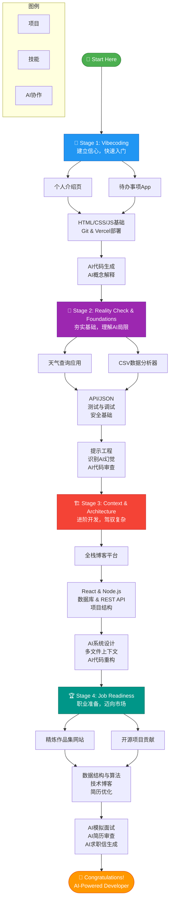

# 🗺️ 统一学习路线 (Gemini版)

**欢迎来到AI编程时代！这条路线图将指导你从零开始，在AI的辅助下，用24周左右的时间成长为一名具备职业竞争力的开发者。**

与传统学习路径不同，我们不只将AI视为一个问答工具。我们的核心理念是：**学习如何与AI高效协作，共同完成软件开发。** 这是一条专注于培养“AI协作能力”的元学习路径。

:::tip 核心理念
- **项目驱动**: 在真实项目中学习，而非枯燥地啃理论。
- **AI协作**: 将AI作为你的结对编程伙伴、架构师和代码审查员。
- **快速迭代**: 快速构建、快速失败、快速学习。
:::

---

## 📍 四阶段学习路径

我们将整个学习过程分为四个循序渐进的阶段，每个阶段都有明确的目标、核心技能和实践项目。

---

## 🚀 Stage 1: Vibecoding (Weeks 1-3)

**目标：** 消除对编程的恐惧，通过AI快速构建看得见的项目，建立“我能行”的信心。

| 项目 | 核心技能 | AI协作技巧 |
|---|---|---|
| 1. **个人介绍网页** | HTML, CSS基础 | 使用AI生成页面结构和样式，解释CSS属性。 |
| 2. **待办事项App** | JavaScript基础, DOM操作, localStorage | 让AI生成核心增删改查逻辑，学习并手动复现。 |

### 🛠️ 工具与资源
- **开发环境**: [Cursor](https://cursor.com) (首选), [Replit](https://replit.com) (在线)
- **版本控制**: [Git](https://git-scm.com) & [GitHub](https://github.com)
- **部署**: [Vercel](https://vercel.com) (一键部署)
- **AI助手**: [ChatGPT](https://chatgpt.com), [Claude](https://claude.ai)

### ✅ 里程碑
- 成功部署了至少一个有公开URL的项目。
- 完成了首次代码提交（`git commit`）。
- 能够用自然语言向AI描述需求并获得代码。

---

## 🧠 Stage 2: Reality Check & Foundations (Weeks 4-8)

**目标：** 学习软件开发的核心基础，同时深刻理解AI的优势、短板和“幻觉”，培养批判性思维。

| 项目 | 核心技能 | AI协作技巧 |
|---|---|---|
| 1. **天气查询应用** | 调用第三方API, 处理JSON, 异步操作 | 让AI解释API文档，生成数据请求和错误处理的代码。 |
| 2. **CSV数据分析器** | 文件处理, 数据可视化 (Chart.js) | 使用AI进行代码审查，寻找潜在bug和性能问题。 |

### 💡 核心任务：AI能力测试
- **识别幻觉**: 给AI一个复杂或模糊的需求，观察并修正其“一本正经胡说八道”的输出。
- **安全审计**: 让AI生成带有用户输入处理的代码，检查是否存在明显的安全漏洞（如XSS）。
- **提示工程**: 学习编写结构化、富含上下文的提示（Prompt），对比简单提示和复杂提示的输出质量差异。

### ✅ 里程碑
- 能列出3个适合AI和3个不适合AI的编程场景。
- 掌握了“信任但验证”的原则，能主动测试和调试AI生成的代码。
- 能够编写单元测试（如使用Jest/Vitest）来验证代码的正确性。

---

## 🏗️ Stage 3: Context & Architecture (Weeks 9-16)

**目标：** 学习构建更复杂的应用程序，并掌握向AI提供多文件、长上下文信息，以进行系统设计的技巧。

| 项目 | 核心技能 | AI协作技巧 |
|---|---|---|
| **全栈博客平台** | **前端**: React, 路由 **后端**: Node.js, Express **数据库**: PostgreSQL/SQLite **API**: RESTful设计 | **系统设计**: 与AI讨论数据库模式、API端点和组件划分。 **多文件重构**: 使用Cursor等工具，进行跨多个文件的代码重构。 **高级提示**: 创建项目级的`.cursorrules`，让AI遵循项目规范。 |

### 💡 核心任务：AI驱动的架构设计
- **需求分析**: 向AI提供完整的应用需求文档。
- **技术选型**: 与AI讨论不同技术栈的优劣。
- **架构图绘制**: 让AI生成Mermaid语法的图表，可视化你的系统架构。
- **代码骨架生成**: 基于确定的架构，让AI生成项目的基础目录结构和代码骨架。

### ✅ 里程碑
- 完成了一个包含前后端和数据库的全栈项目。
- 能够熟练使用AI工具进行涉及5个以上文件的重构任务。
- 完成了一份完整的、由AI协助完成的架构设计文档。

---

## 🏆 Stage 4: Job Readiness (Weeks 17-24+)

**目标：** 将你的技能和项目转化为有吸引力的职业资本，为进入就业市场做好充分准备。

| 任务 | 核心技能 | AI协作技巧 |
|---|---|---|
| 1. **精炼作品集网站** | SEO优化, 技术写作 | 使用AI审查项目描述，使其更具冲击力和专业性。 |
| 2. **开源项目贡献** | 阅读他人代码, 协作流程 | 让AI帮助你理解大型项目的代码库，找到适合入门的issue。 |
| 3. **面试准备** | 数据结构与算法, 系统设计 | **AI模拟面试**: 让AI扮演面试官，进行技术和行为面试。 **简历审查**: 让AI根据目标岗位优化你的简历。 **求职信生成**: 根据公司和职位，生成个性化的求职信。 |

### 💡 核心任务：建立个人品牌
- **撰写技术博客**: 记录你在项目中遇到的挑战和解决方案。
- **优化LinkedIn**: 打造专业的在线形象。
- **持续学习**: 选择一个方向深入（如TypeScript, GraphQL, Docker）。

### ✅ 里程碑
- 拥有一个展示了6-8个高质量项目的个人作品集网站。
- 成功向一个开源项目贡献了至少一个被合并的Pull Request。
- 能够自信地通过AI模拟面试，并流利地阐述自己的项目。

---

##  Mistakes to Avoid & Success Metrics

(本部分内容与 `ai-coding-roadmap.mdx` 类似，重点强调在AI协作背景下的常见错误)

- **避免盲目复制**: 永远不要在不理解的情况下粘贴AI生成的代码。复述、重写、测试是学习的关键。
- **避免孤立学习**: 积极参与社区，分享你与AI协作的经验和困惑。
- **跟踪你的成长**: 每周记录GitHub提交次数、完成的项目、解决的bug，你会看到惊人的进步。

**准备好开始了吗？你的AI编程之旅，现在正式启航！** 🚀
