import RoadmapAnalytics from '@site/src/components/RoadmapAnalytics';

<RoadmapAnalytics />

# 🗺️ Learning Roadmap v1.1

**Your journey from zero to AI-powered developer in 5-9 weeks**

:::info What's New in v1.1
✨ **Enhanced with AI Collaboration Techniques**
- 🤖 Clear guidance on "how AI helps you" at each level
- 💬 Actionable prompts you can copy and use
- 🎯 Learn to work WITH AI, not just use it
:::

This roadmap breaks down your learning into **12 levels** across **3 stages**, with hands-on projects at every step. Each level builds on the previous one, so you'll always know exactly what to do next.

:::tip Estimated Time
**5-9 weeks** total (1-2 hours per day)
- Stage 0: 2-4 weeks
- Stage 1: 1-2 weeks
- Stage 2: 2-3 weeks
:::

---

## 📍 Where Are You?

Not sure where to start? Use this quick guide:

| If you are... | Start here |
|---------------|------------|
| 👶 Never coded before | **Stage 0, Level 0.1** - Build your first webpage today |
| 🎯 Built a few projects with AI | **Stage 1, Level 1.1** - Learn what AI can't do |
| 🏗️ Want to build complex apps | **Stage 2, Level 2.1** - Master context & architecture |

---

## 📈 Track Your Progress

**Recommended:** Use GitHub Projects to visualize your journey

**Quick Setup (5 minutes):**
1. Create a new [GitHub Project](https://github.com/features/issues) in your account
2. Add 12 cards: "Level 0.1", "Level 0.2", ..., "Level 2.4"
3. Create columns: "Not Started" | "In Progress" | "Completed"
4. Move cards as you complete each level

**Why this works:**
- ✅ Visual progress = motivation boost
- ✅ Easy to share with friends or recruiters
- ✅ Syncs naturally with your GitHub commits

**Alternative:** Notion template (coming soon)

:::tip Optional
Progress tracking is a tool, not a requirement. Choose what works for you, or skip it entirely. The goal is learning, not checking boxes.
:::

---

## 🎮 Complete Learning Path

```mermaid
graph TB
    Start([👋 Start Here]) --> S0[🎮 Stage 0: Vibecoding<br/>消除恐惧，今天就编程]

    S0 --> L01[Level 0.1: 第一行代码<br/>Build first webpage]
    L01 --> L02[Level 0.2: 本地开发<br/>Setup local environment]
    L02 --> L03[Level 0.3: API 集成<br/>Connect to APIs]
    L03 --> L04[Level 0.4: 部署上线<br/>Deploy to production]
    L04 --> P0[🎯 Stage 0 Project<br/>Build mini project]

    P0 --> S1[🧠 Stage 1: Reality Check<br/>理解 AI 局限性]

    S1 --> L11[Level 1.1: AI 局限性<br/>Understand limitations]
    L11 --> L12[Level 1.2: 提示工程<br/>Advanced prompting]
    L12 --> L13[Level 1.3: 测试调试<br/>Testing & debugging]
    L13 --> L14[Level 1.4: 安全实践<br/>Security basics]

    L14 --> S2[🏗️ Stage 2: Context & Architecture<br/>掌握上下文与架构]

    S2 --> L21[Level 2.1: 项目结构<br/>Project organization]
    L21 --> L22[Level 2.2: 长上下文<br/>Multi-file editing]
    L22 --> L23[Level 2.3: 高级提示<br/>Advanced context]
    L23 --> L24[Level 2.4: 架构设计<br/>System design]
    L24 --> P2[🎯 Stage 2 Project<br/>Full-stack application]

    P2 --> End([🎉 Congratulations!<br/>AI-Powered Developer])

    style Start fill:#4CAF50,stroke:#2E7D32,color:#fff
    style End fill:#FF9800,stroke:#E65100,color:#fff
    style S0 fill:#2196F3,stroke:#1565C0,color:#fff
    style S1 fill:#9C27B0,stroke:#6A1B9A,color:#fff
    style S2 fill:#F44336,stroke:#C62828,color:#fff
    style P0 fill:#FFD700,stroke:#FFA000,color:#000
    style P2 fill:#FFD700,stroke:#FFA000,color:#000
```



---

## 🎮 Stage 0: Vibecoding

**Goal:** Eliminate fear, start coding TODAY
**Duration:** 2-4 weeks (1-2 hours/day)

### Level 0.1: 第一行代码 (First Code)

**What you'll learn:**
- Experience the magic of AI-assisted programming
- Zero setup required
- Build confidence: "I can code!"

**Project:** Build a simple personal introduction webpage (HTML + CSS)

#### 🤖 How AI Helps You

| Task | What You Do | How AI Helps |
|------|-------------|--------------|
| **Learn Concepts** | Understand HTML tags | Ask: "Explain HTML tags like \<h1\>, \<p\>, \<div\> using everyday analogies" |
| **Generate Code** | Create page structure | Ask: "Create a personal intro page with semantic HTML: profile photo, name, bio, skill tags" |
| **Style the Page** | Apply CSS styling | Ask: "Use Flexbox to center all content vertically and horizontally" |
| **Debug Issues** | Fix broken layout | Ask: "My div isn't centering. Here's my CSS: [code]. What's wrong?" |
| **Learn Best Practices** | Write clean code | Ask: "Review my HTML for accessibility and semantic structure" |

#### 💡 Example Prompts

**Learning a concept:**
```
Explain CSS Flexbox like I'm 10 years old.
Use everyday analogies (like organizing toys in a box).
Give me 3 simple examples I can try.
```

**Generating code:**
```
Create a personal introduction webpage using HTML and CSS.

Requirements:
- Semantic HTML5 structure
- Profile photo (use placeholder image)
- Name as h1
- One-paragraph bio
- 3 skill tags (like badges)
- Center everything using Flexbox
- Clean, minimal design

Add comments explaining each section.
Don't use any frameworks - just HTML + CSS.
```

**Debugging:**
```
My personal intro page has a problem: the profile photo is too large
and pushing other elements off-screen.

Here's my HTML:
[paste code]

Here's my CSS:
[paste code]

Please:
1. Identify the problem
2. Give me the fix
3. Explain why this happened (so I can avoid it next time)
```

**Tools:**
- [Replit AI](https://replit.com) (free) - Online IDE with AI assistant
- [ChatGPT](https://chatgpt.com) (free tier) - Explain code & answer questions
- Alternative: [v0.dev](https://v0.dev) (generate UI components)

**Resources:**
- [Replit: Build with AI Tutorial](https://replit.com/learn)
- [Fireship: 10 web apps with AI (14 min)](https://www.youtube.com/watch?v=UG3YC_jqPDg)
- [HTML in 100 Seconds](https://youtu.be/ok-plXXHlWw) - Quick overview

**Checkpoint:**
- ✅ Published your first webpage (live URL)
- ✅ Modified code with AI and saw results
- ✅ Can describe what you want in natural language
- ✅ Understand basic HTML structure and CSS styling

**Estimated time:** 2-3 days

:::tip 💡 Pro Tip
Don't just copy AI code! Type it out manually, change some values, see what breaks. Learning happens when you experiment.
:::

---

### Level 0.2: 本地开发 (Setup Local Environment)

**What you'll learn:**
- Install local development environment
- Understand files, folders, editors
- Use professional tools (kept simple)
- Version control basics with Git

**Project:** Build a To-Do List app locally (HTML, CSS, JavaScript with localStorage)

#### 🤖 How AI Helps You

| Task | What You Do | How AI Helps |
|------|-------------|--------------|
| **Tool Setup** | Install Cursor/VS Code | Ask: "Guide me through installing Cursor step-by-step for a complete beginner" |
| **Learn JavaScript** | Understand variables, functions | Ask: "Explain JavaScript variables and functions with a to-do list example" |
| **DOM Manipulation** | Add/delete tasks from page | Ask: "How do I add a new item to an HTML list when user clicks a button?" |
| **Data Persistence** | Save tasks to localStorage | Ask: "Explain localStorage with code examples for saving/loading a to-do list" |
| **Git Basics** | Commit and push code | Ask: "Teach me Git basics: what do init, add, commit, and push do?" |
| **Debug JavaScript** | Fix "undefined" errors | Ask: "I'm getting 'Cannot read property of undefined'. Here's my code: [code]" |

#### 💡 Example Prompts

**Tool installation:**
```
I'm a complete beginner. Guide me through installing Cursor IDE:
1. Where to download
2. Installation steps for [Mac/Windows/Linux]
3. First-time setup recommendations
4. How to create my first project

Explain each step clearly.
```

**Learning JavaScript:**
```
I know HTML/CSS but not JavaScript. Teach me:
1. Variables (let, const)
2. Functions
3. Event listeners (onclick)
4. DOM manipulation (getElementById, querySelector)

Use a to-do list app as the teaching example.
Give me code I can try immediately.
```

**Building the feature:**
```
Help me build a to-do list app feature by feature.

Current task: Add new todo item
Requirements:
- Input field for task text
- "Add" button
- When clicked, add item to list below
- Clear input after adding

Give me:
1. HTML structure
2. CSS (basic styling)
3. JavaScript with detailed comments
4. Explanation of how it works
```

**Debugging:**
```
My to-do app isn't working. When I click "Add", nothing happens.

Here's my HTML:
[paste code]

Here's my JavaScript:
[paste code]

Console shows no errors. What am I missing?

Please:
1. Find the bug
2. Explain why it's not working
3. Give me the fixed code
4. Teach me how to debug this myself next time
```

**Git workflow:**
```
I've finished my to-do app. Teach me Git:
1. How to create a GitHub account
2. Initialize Git in my project folder
3. Make my first commit
4. Push to GitHub
5. View my code online

Step-by-step commands with explanations.
```

**Tools:**
- [Cursor](https://cursor.com) (free tier) - Best AI editor for beginners
- Alternative: [VS Code](https://code.visualstudio.com) + [GitHub Copilot](https://github.com/features/copilot)
- [Git](https://git-scm.com) + [GitHub](https://github.com) (version control intro)

**Resources:**
- [Cursor IDE Tutorial for Beginners (25 min)](https://www.youtube.com/watch?v=4q0ekTZqZZM)
- [Build a Todo App with AI (30 min)](https://www.youtube.com/watch?v=NgX5qxSwUFg)
- [Cursor Quickstart Guide](https://docs.cursor.com/get-started/migrate-from-vscode)
- [JavaScript in 100 Seconds](https://youtu.be/DHjqpvDnNGE)

**Checkpoint:**
- ✅ Cursor or VS Code installed and running
- ✅ Completed To-Do app with add/delete features
- ✅ Tasks persist after page reload (localStorage)
- ✅ Code committed to GitHub (first version control experience)
- ✅ Understand basic JavaScript and DOM manipulation

**Estimated time:** 4-5 days

:::warning ⚠️ Common Mistake
Don't skip Git! Start committing from day one. Future you will thank present you.
:::

---

### Level 0.3: API 集成 (First API Integration)

**What you'll learn:**
- Understand frontend vs backend relationship
- Call third-party APIs
- Handle async operations (async/await)
- Process JSON data
- Handle errors gracefully

**Project:** Build one of these (your choice):
- **Weather query app** (Recommended for beginners)
- Discord bot
- Chrome extension

#### 🤖 How AI Helps You

| Task | What You Do | How AI Helps |
|------|-------------|--------------|
| **Understand APIs** | Learn what APIs are | Ask: "Explain APIs like I'm 5. Use restaurant ordering as an analogy" |
| **Read API Docs** | Navigate documentation | Ask: "Explain OpenWeatherMap API docs. What do I need to get weather data?" |
| **API Authentication** | Get and use API keys | Ask: "How do I safely use API keys? What's .env and why do I need it?" |
| **Make API Calls** | Use fetch() or axios | Ask: "Show me how to call OpenWeatherMap API with fetch(). Include error handling" |
| **Parse JSON** | Extract data from response | Ask: "Parse this JSON and extract temperature: [paste API response]" |
| **Async JavaScript** | Understand promises | Ask: "Explain async/await with a weather app example. Why do I need it?" |
| **Error Handling** | Deal with failed requests | Ask: "My API call fails when city not found. How to handle this gracefully?" |

#### 💡 Example Prompts

**Understanding APIs:**
```
I'm new to APIs. Explain:
1. What is an API?
2. How does a weather API work?
3. What are API keys and why do I need them?
4. What is JSON and how do I read it?

Use simple language and examples I can relate to.
```

**Getting started:**
```
I want to build a weather app that shows current weather for any city.

Guide me through:
1. Sign up for OpenWeatherMap API (free tier)
2. Get my API key
3. Make my first API call (just in browser console)
4. Understand the response

Give me exact steps and code examples.
```

**Building the feature:**
```
Build a weather app feature by feature.

Current feature: Search by city name

Requirements:
- Input field for city name
- "Search" button
- Display: city name, temperature, weather description, icon
- Show "City not found" error if invalid

Use OpenWeatherMap API: api.openweathermap.org/data/2.5/weather

Give me:
1. HTML structure
2. JavaScript with fetch()
3. Error handling
4. Comments explaining each part
```

**Debugging async code:**
```
My weather app shows "undefined" for temperature.

Here's my code:
[paste code]

The API call seems to work (I see data in console),
but I can't display it on the page.

What's wrong with my async handling?
```

**Securing API keys:**
```
I want to deploy my weather app but I hear I shouldn't expose my API key.

Teach me:
1. Why API keys need protection
2. What is a .env file?
3. How to use environment variables
4. How to deploy with hidden API keys (Vercel/Netlify)

Give me step-by-step instructions.
```

**Tools:**
- Cursor + AI Chat (explain API docs)
- [Postman](https://www.postman.com) / [Thunder Client](https://www.thunderclient.com) (test APIs)
- **Free APIs:**
  - [OpenWeatherMap](https://openweathermap.org/api) (Weather)
  - [Discord API](https://discord.com/developers/docs) (Bot)
  - [Chrome Extensions API](https://developer.chrome.com/docs/extensions) (Extension)

**Resources:**
- [Create Your First Discord Bot with AI (20 min)](https://www.youtube.com/watch?v=hoDLj0IzZMU)
- [ChatGPT for Coding: Complete Guide (45 min)](https://www.youtube.com/watch?v=jRAAaDll34Q)
- [Async JavaScript in 100 Seconds](https://youtu.be/vn3tm0quoqE)

**Checkpoint:**
- ✅ Successfully called at least one external API
- ✅ Can process and display API data
- ✅ Understand basic async/await usage
- ✅ Handle errors gracefully (invalid input, network failures)
- ✅ Secured API keys (not in public GitHub repo)

**Estimated time:** 5-7 days

:::danger 🚨 Critical
NEVER commit API keys to GitHub! Use `.env` files and add them to `.gitignore`.
:::

---

### Level 0.4: 部署上线 (Deploy to Production)

**What you'll learn:**
- Make your work visible to the world
- Understand frontend deployment process
- Configure custom domains
- Use environment variables in production
- Get satisfaction from sharing your creation

**Project:** Deploy one of your previous projects to production (recommend the weather app)

#### 🤖 How AI Helps You

| Task | What You Do | How AI Helps |
|------|-------------|--------------|
| **Choose Platform** | Pick deployment service | Ask: "Compare Vercel vs Netlify vs GitHub Pages for beginners. Which should I use?" |
| **Deployment Setup** | Configure build settings | Ask: "Guide me through deploying to Vercel step-by-step" |
| **Environment Variables** | Set up production secrets | Ask: "How do I add environment variables to Vercel for my API keys?" |
| **Custom Domain** | Connect personal domain | Ask: "I bought example.com. How do I connect it to my Vercel site?" |
| **Debugging Deployment** | Fix build failures | Ask: "My Vercel build fails with [error]. Here's my setup: [details]" |
| **Monitor Site** | Check performance | Ask: "How do I know if my deployed site is working properly?" |

#### 💡 Example Prompts

**Choosing a platform:**
```
I want to deploy my weather app (HTML/CSS/JS).

Compare these for me:
- Vercel
- Netlify
- GitHub Pages

Which is:
- Easiest for beginners?
- Supports environment variables?
- Has free HTTPS?
- Best for learning?

Recommend one and explain why.
```

**Deployment walkthrough:**
```
Deploy my weather app to Vercel step-by-step.

Current setup:
- Project in GitHub repo
- Uses OpenWeatherMap API (key in .env file)
- Pure HTML/CSS/JavaScript (no framework)

Guide me through:
1. Creating Vercel account
2. Connecting GitHub repo
3. Configuring build settings
4. Adding environment variables
5. First deployment
6. Checking if it works

Explain each step clearly.
```

**Handling environment variables:**
```
My weather app works locally but fails in production.
Error: "API key is undefined"

I have API_KEY in .env file locally.

How do I:
1. Access this environment variable in my JavaScript?
2. Set it in Vercel dashboard?
3. Verify it's working?

Give me exact code and settings.
```

**Custom domain setup:**
```
I bought my-weather-app.com and want to use it for my Vercel site.

Teach me:
1. What DNS records are
2. How to configure my domain registrar
3. How to add domain in Vercel
4. How long does it take?
5. How to troubleshoot if it doesn't work?

Assume I know nothing about domains.
```

**Debugging deployment:**
```
My Vercel deployment failed with this error:
[paste error log]

My project structure:
- index.html
- style.css
- script.js
- .env (for API key)

What's wrong and how do I fix it?
```

**Tools:**
- [Vercel](https://vercel.com) (recommended) - Zero-config deployment, auto HTTPS
- [Netlify](https://netlify.com) (alternative)
- [GitHub Pages](https://pages.github.com) (for static sites, no server-side secrets)

**Resources:**
- [Deploy to Vercel in 5 Minutes](https://vercel.com/docs/getting-started-with-vercel)
- [Netlify Deployment Tutorial](https://docs.netlify.com/get-started/)
- [GitHub Pages Guide](https://pages.github.com/)

**Checkpoint:**
- ✅ Project deployed with public URL
- ✅ Understand Git push → auto-deploy workflow
- ✅ Environment variables configured correctly
- ✅ HTTPS enabled automatically
- ✅ Can share project link with friends/community
- ✅ Site loads quickly and works on mobile

**Estimated time:** 2-3 days

:::tip 💡 Pro Tip
Deploy early, deploy often. Don't wait for "perfection" - ship it, get feedback, iterate.
:::

---

### 🎯 Stage 0 Graduation Project

**Requirements:** Choose your direction, complete a mini project (2-3 days)

**Example directions:**
- **Web app:** Personal blog, portfolio site, utility tool
- **Bot/Automation:** Telegram bot, data scraper, automation script
- **Creative:** Simple game, data visualization, music player

#### 🤖 How AI Helps You

| Phase | What You Do | How AI Helps |
|-------|-------------|--------------|
| **Planning** | Choose project scope | Ask: "I want to build [idea]. Break it down into 3-5 manageable features for a beginner" |
| **Architecture** | Design structure | Ask: "Design file structure for [project]. List all files I need and what each does" |
| **Implementation** | Build features | Ask: "Implement [feature]. Guide me step-by-step with code examples" |
| **Integration** | Connect pieces | Ask: "I have [module A] and [module B]. How do I make them work together?" |
| **Polish** | Improve UX/UI | Ask: "Review my project's UX. Suggest 3 improvements for better user experience" |
| **Documentation** | Write README | Ask: "Generate a README for my project. Include: setup, usage, screenshots, tech stack" |

#### 💡 Project Planning Prompt

```
I want to build a [project idea] as my Stage 0 graduation project.

Help me plan:

1. **Feasibility Check**
   - Is this appropriate for a beginner who just finished Stage 0?
   - What skills from Stage 0 will I use?
   - What new things will I learn?

2. **Feature Breakdown**
   - Core features (must-have)
   - Nice-to-have features
   - What to skip for v1

3. **Technical Stack**
   - HTML/CSS/JavaScript enough? Or do I need something else?
   - What APIs or libraries should I consider?
   - Any potential blockers?

4. **Timeline**
   - Realistic completion time for 2-3 hours/day?
   - Day-by-day plan

Be honest if my idea is too ambitious. Suggest a simpler version if needed.
```

**Evaluation criteria:**
- ✅ Code hosted on GitHub
- ✅ Has basic README documentation
- ✅ Deployed to production (if applicable)
- ✅ Shared in community or with friends
- ✅ Demonstrates skills from all 4 levels

**Estimated time:** 2-3 days

:::note 📝 Showcase Your Work
Tag your project with #AICodeLearner on social media! Share your learning journey.
:::

---

## 🎉 Congratulations! Stage 0 Complete

You just learned to code with AI in 2-4 weeks. What's next? **The choice is yours.**

### 🎯 Choose Your Path

**Option A: Continue Web Development**
You enjoyed building web projects. Let's go deeper.
→ Continue to [Stage 1](/docs/roadmap#-stage-1-reality-check) (React, APIs, databases)

**Option B: Explore Computer Science Theory**
You want to understand how things work under the hood.
→ [CS50 (Harvard)](https://cs50.harvard.edu) | [MIT OpenCourseWare](https://ocw.mit.edu) | [freeCodeCamp](https://freecodecamp.org)

**Option C: Apply Coding to Your Domain**
You want to use coding in your existing field:
- **Data Science:** [Python for Data Analysis](https://www.oreilly.com/library/view/python-for-data/9781491957653/) | [Kaggle Learn](https://www.kaggle.com/learn)
- **Design:** [Frontend Masters](https://frontendmasters.com) | [CSS-Tricks](https://css-tricks.com)
- **Marketing:** [Zapier Automation](https://zapier.com/learn) | [Google Analytics API](https://developers.google.com/analytics)
- **Research:** [Jupyter Notebooks](https://jupyter.org/try) | [matplotlib tutorials](https://matplotlib.org/stable/tutorials/index.html)

**Option D: Use AI Tools Like a Pro**
You just want to use AI tools effectively:
→ [Cursor Tips & Tricks](https://cursor.sh/docs) | [GitHub Copilot Guide](https://docs.github.com/copilot) | [Prompt Engineering 101](/docs/prompt-engineering-101)

**No wrong choice!** The roadmap sparked your interest. Now explore what excites you.

:::tip Optional Feedback
[Tell us which path you chose](https://forms.gle/placeholder) (1 minute, helps us improve)
:::

---

## 🎓 Stage 0 Complete - What You've Achieved

Congratulations! You've completed Stage 0 🎉

**You can now:**
- ✅ Build and deploy web pages from scratch
- ✅ Use AI effectively to learn and generate code
- ✅ Work with HTML, CSS, and JavaScript basics
- ✅ Call APIs and handle asynchronous operations
- ✅ Use Git and GitHub for version control
- ✅ Deploy projects to production

**Portfolio so far:**
- Personal introduction page
- To-Do list app with localStorage
- Weather app (or Discord bot/Chrome extension)
- Graduation project
- All hosted on GitHub with live demos

**Next steps:**
Ready to understand AI's limitations and become a critical thinker? Continue to **[Stage 1: Reality Check →](/docs/roadmap#-stage-1-reality-check)**

---

*The remaining stages (Stage 1 & 2) will be enhanced with AI collaboration techniques in the next update. For now, refer to the [original roadmap](/docs/roadmap) for these sections.*

---

**Version:** 1.1.0
**Last updated:** 2025-10-27
**Changelog:** Added AI collaboration techniques and detailed prompts for Stage 0
