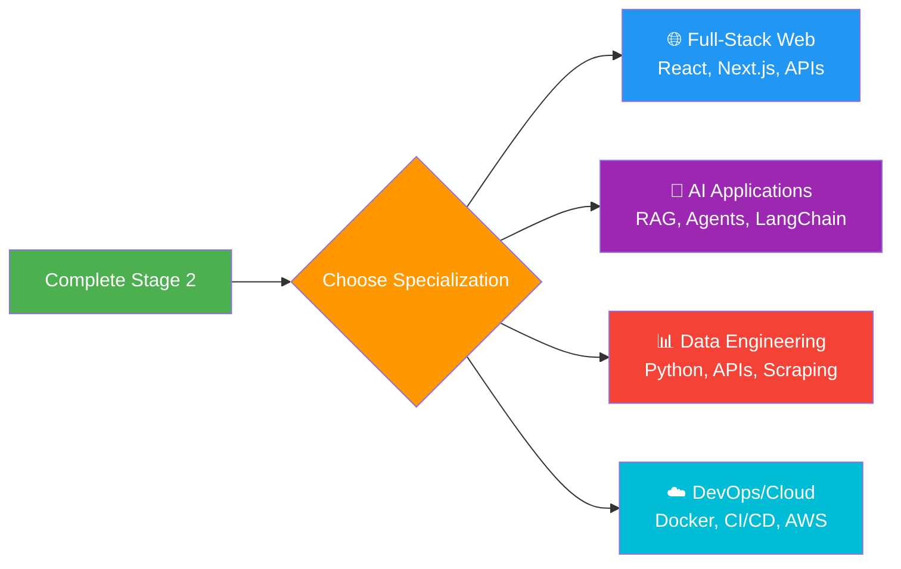

# Learning Roadmap

**Your journey from zero to AI-powered developer in 5-9 weeks**

This roadmap breaks down your learning into **12 levels** across **3 stages**, with hands-on projects at every step. Each level builds on the previous one, so you'll always know exactly what to do next.

:::tip Estimated Time
**5-9 weeks** total (1-2 hours per day)
- Stage 0: 2-4 weeks
- Stage 1: 1-2 weeks
- Stage 2: 2-3 weeks
:::

---

## Where Are You?

Not sure where to start? Use this quick guide:

| If you are... | Start here |
|---------------|------------|
| 👶 Never coded before | **Stage 0, Level 0.1** - Build your first webpage today |
| 🎯 Built a few projects with AI | **Stage 1, Level 1.1** - Learn what AI can't do |
| 🏗️ Want to build complex apps | **Stage 2, Level 2.1** - Master context & architecture |

---

## Complete Learning Path

```mermaid
graph TB
    Start([👋 Start Here]) --> S0[🎮 Stage 0: Vibecoding<br/>消除恐惧，今天就编程]

    S0 --> L01[Level 0.1: 第一行代码<br/>Build first webpage]
    L01 --> L02[Level 0.2: 本地开发<br/>Setup local environment]
    L02 --> L03[Level 0.3: API 集成<br/>Connect to APIs]
    L03 --> L04[Level 0.4: 部署上线<br/>Deploy to production]
    L04 --> P0[🎯 Stage 0 Project<br/>Build mini project]

    P0 --> S1[🧠 Stage 1: Reality Check<br/>理解 AI 局限性]

    S1 --> L11[Level 1.1: AI 局限性<br/>Understand limitations]
    L11 --> L12[Level 1.2: 提示工程<br/>Advanced prompting]
    L12 --> L13[Level 1.3: 测试调试<br/>Testing & debugging]
    L13 --> L14[Level 1.4: 安全实践<br/>Security basics]

    L14 --> S2[🏗️ Stage 2: Context & Architecture<br/>掌握上下文与架构]

    S2 --> L21[Level 2.1: 项目结构<br/>Project organization]
    L21 --> L22[Level 2.2: 长上下文<br/>Multi-file editing]
    L22 --> L23[Level 2.3: 高级提示<br/>Advanced context]
    L23 --> L24[Level 2.4: 架构设计<br/>System design]
    L24 --> P2[🎯 Stage 2 Project<br/>Full-stack application]

    P2 --> End([🎉 Congratulations!<br/>AI-Powered Developer])

    style Start fill:#4CAF50,stroke:#2E7D32,color:#fff
    style End fill:#FF9800,stroke:#E65100,color:#fff
    style S0 fill:#2196F3,stroke:#1565C0,color:#fff
    style S1 fill:#9C27B0,stroke:#6A1B9A,color:#fff
    style S2 fill:#F44336,stroke:#C62828,color:#fff
    style P0 fill:#FFD700,stroke:#FFA000,color:#000
    style P2 fill:#FFD700,stroke:#FFA000,color:#000
```

---

## Stage 0: Vibecoding

**Goal:** Eliminate fear, start coding TODAY
**Duration:** 2-4 weeks (1-2 hours/day)

### Level 0.1: 第一行代码 (First Code)

**What you'll learn:**
- Experience the magic of AI-assisted programming
- Zero setup required
- Build confidence: "I can code!"

**Project:** Build a simple personal introduction webpage (HTML + CSS)

**Tools:**
- [Replit AI](https://replit.com) (free) - Online IDE with AI assistant
- [ChatGPT](https://chatgpt.com) (free tier) - Explain code & answer questions
- Alternative: [v0.dev](https://v0.dev) (generate UI components)

**Resources:**
- [Replit: Build with AI Tutorial](https://replit.com/learn)
- [Fireship: 10 web apps with AI (14 min)](https://www.youtube.com/watch?v=UG3YC_jqPDg)

**Checkpoint:**
- ✅ Published your first webpage (live URL)
- ✅ Modified code with AI and saw results
- ✅ Can describe what you want in natural language

**Estimated time:** 2-3 days

---

### Level 0.2: 本地开发 (Setup Local Environment)

**What you'll learn:**
- Install local development environment
- Understand files, folders, editors
- Use professional tools (kept simple)

**Project:** Build a To-Do List app locally (HTML, CSS, JavaScript with localStorage)

**Tools:**
- [Cursor](https://cursor.com) (free tier) - Best AI editor for beginners
- Alternative: [VS Code](https://code.visualstudio.com) + [GitHub Copilot](https://github.com/features/copilot)
- [Git](https://git-scm.com) + [GitHub](https://github.com) (version control intro)

**Resources:**
- [Cursor IDE Tutorial for Beginners (25 min)](https://www.youtube.com/watch?v=4q0ekTZqZZM)
- [Build a Todo App with AI (30 min)](https://www.youtube.com/watch?v=NgX5qxSwUFg)
- [Cursor Quickstart Guide](https://docs.cursor.com/get-started/migrate-from-vscode)

**Checkpoint:**
- ✅ Cursor or VS Code installed and running
- ✅ Completed To-Do app with add/delete features
- ✅ Code committed to GitHub (first version control experience)

**Estimated time:** 4-5 days

---

### Level 0.3: API 集成 (First API Integration)

**What you'll learn:**
- Understand frontend vs backend relationship
- Call third-party APIs
- Handle async operations (async/await)

**Project:** Build one of these (your choice):
- Weather query app
- Discord bot
- Chrome extension

**Tools:**
- Cursor + AI Chat (explain API docs)
- [Postman](https://www.postman.com) / [Thunder Client](https://www.thunderclient.com) (test APIs)
- **Free APIs:** [OpenWeatherMap](https://openweathermap.org/api), [Discord API](https://discord.com/developers/docs), [Chrome Extensions API](https://developer.chrome.com/docs/extensions)

**Resources:**
- [Create Your First Discord Bot with AI (20 min)](https://www.youtube.com/watch?v=hoDLj0IzZMU)
- [ChatGPT for Coding: Complete Guide (45 min)](https://www.youtube.com/watch?v=jRAAaDll34Q)

**Checkpoint:**
- ✅ Successfully called at least one external API
- ✅ Can process and display API data
- ✅ Understand basic async/await usage

**Estimated time:** 5-7 days

---

### Level 0.4: 部署上线 (Deploy to Production)

**What you'll learn:**
- Make your work visible to the world
- Understand frontend deployment process
- Get satisfaction from sharing your creation

**Project:** Deploy one of your previous projects to production

**Tools:**
- [Vercel](https://vercel.com) (recommended) - Zero-config deployment, auto HTTPS
- [Netlify](https://netlify.com) (alternative)
- [GitHub Pages](https://pages.github.com) (for static sites)

**Resources:**
- Tutorial: Deploy with AI assistance (AI generates deployment config)
- Tutorial: Custom domain setup
- Tutorial: Environment variables for API keys

**Checkpoint:**
- ✅ Project deployed with public URL
- ✅ Understand Git push → auto-deploy workflow
- ✅ Can share project link with friends/community

**Estimated time:** 2-3 days

---

### Stage 0 Graduation Project

**Requirements:** Choose your direction, complete a mini project (2-3 days)

**Example directions:**
- **Web app:** Personal blog, portfolio site, utility tool
- **Bot/Automation:** Telegram bot, data scraper, automation script
- **Creative:** Simple game, data visualization, music player

**Evaluation criteria:**
- ✅ Code hosted on GitHub
- ✅ Has basic README documentation
- ✅ Deployed to production (if applicable)
- ✅ Shared in community or with friends

**Estimated time:** 2-3 days

:::tip 🎓 Stage 0 Complete! What's Next?
恭喜完成 Vibecoding 阶段！接下来你将学习 AI 的真实能力边界。
**Congratulations on completing Stage 0! Next, you'll learn the true capabilities and limitations of AI.**

👉 Ready to level up? [Continue to Stage 1: Reality Check](#-stage-1-reality-check)
:::

---

## Stage 1: Reality Check

**Goal:** Understand AI limitations, develop critical thinking
**Duration:** 1-2 weeks (1-2 hours/day)

### Level 1.1: AI 的优势与局限 (AI Strengths & Limits)

**What you'll learn:**
- Identify tasks where AI excels
- Recognize scenarios where AI struggles
- Understand "hallucination" phenomenon

**Project:** Intentionally make AI fail, then fix it

**Task list:**
1. Ask AI to generate complex algorithms (e.g., sorting), verify correctness
2. Give AI buggy code, see if it identifies the bug
3. Ask AI to generate security code (e.g., authentication), find vulnerabilities

**Tools:**
- ChatGPT / Claude (compare different model outputs)
- [LLM Comparison Sites](https://lmarena.ai)

**Resources:**
- [Andrej Karpathy on AI Coding](https://twitter.com/karpathy/status/1748863275736449258)
- [Simon Willison: Things I learned about LLMs](https://simonwillison.net/2023/Aug/3/weird-world-of-llms/)
- [When AI Coding Goes Wrong](https://github.com/facebookresearch/llm-hallucination-survey)

**Checkpoint:**
- ✅ Can list 3 scenarios where AI excels and 3 where it fails
- ✅ Successfully identified and fixed AI-generated bugs
- ✅ Understand why you shouldn't blindly trust AI output

**Estimated time:** 2-3 days

---

### Level 1.2: 提示工程进阶 (Prompt Engineering)

**What you'll learn:**
- Master effective prompt structure
- Break complex tasks into small steps
- Use Few-Shot and Chain-of-Thought techniques

**Project:** Refactor any Stage 0 project using better prompts
- Compare: bad prompts vs good prompts output quality

**Tools:**
- Cursor Rules / `.cursorrules` file (project-level prompt configuration)
- Prompt Libraries (e.g., PromptBase, Anthropic Prompt Library)

**Resources:**
- [OpenAI's Prompt Engineering Guide](https://platform.openai.com/docs/guides/prompt-engineering)
- [GitHub Copilot Best Practices](https://github.blog/developer-skills/github/how-to-write-better-prompts-for-github-copilot/)
- [AI Coding Club: Prompt Engineering 101](/docs/prompt-engineering-101)

**Checkpoint:**
- ✅ Can write clear, specific, context-rich prompts
- ✅ Understand Few-Shot Learning and Chain-of-Thought
- ✅ Created your own `.cursorrules` file

**Estimated time:** 2-3 days

---

### Level 1.3: 测试与调试 (Testing & Debugging)

**What you'll learn:**
- Write tests for AI-generated code
- Use AI to assist debugging
- Understand "trust but verify" principle

**Project:** Add unit tests to a Stage 0 project
- Intentionally introduce bugs, use AI to locate and fix them

**Tools:**
- [Jest](https://jestjs.io) / [Vitest](https://vitest.dev) (JavaScript testing)
- [pytest](https://pytest.org) (Python testing)
- AI Debugging: Cursor Debug feature, ChatGPT error analysis

**Resources:**
- [Testing AI-Generated Code](https://martinfowler.com/articles/exploring-gen-ai.html)
- [The Danger of Trusting AI Code Blindly](https://blog.humphd.org/chasing-the-bear/)

**Checkpoint:**
- ✅ Wrote tests for at least 1 project
- ✅ Can use AI to locate and fix bugs
- ✅ Understand "all code needs verification" principle

**Estimated time:** 3-4 days

---

### Level 1.4: 安全与最佳实践 (Security & Best Practices)

**What you'll learn:**
- Identify security issues in AI-generated code
- Understand common vulnerabilities (OWASP Top 10)
- Protect API keys and sensitive data

**Project:** Security audit of your Stage 0 projects

**Checklist:**
1. Are API keys exposed?
2. Is user input validated?
3. Is HTTPS enabled?
4. Do dependencies have vulnerabilities?

**Tools:**
- [GitHub Dependabot](https://github.com/dependabot) (auto-detect dependency vulnerabilities)
- [Snyk](https://snyk.io) / `npm audit` (security scanning)
- `.env` files (environment variable management)

**Resources:**
- [The False Promise of AI Coding Assistants](https://stackoverflow.blog/2024/06/10/generative-ai-is-not-going-to-build-your-engineering-team-for-you/)

**Checkpoint:**
- ✅ Can identify 3 common security issues in AI code
- ✅ All project API keys moved to environment variables
- ✅ Understand "security is continuous, not one-time"

**Estimated time:** 2-3 days

:::tip 💪 Stage 1 Complete! Ready for Advanced Topics?
你已经理解了 AI 的能力边界！现在让我们学习如何给 AI 提供最佳上下文。
**You now understand AI's boundaries! Let's learn how to provide optimal context to AI.**

👉 Continue your journey: [Stage 2: Context & Architecture](#️-stage-2-context--architecture)
:::

---

## Stage 2: Context & Architecture

**Goal:** Master providing context to AI, design AI-friendly architectures
**Duration:** 2-3 weeks (2-3 hours/day)

### Level 2.1: 项目结构设计 (Project Structure)

**What you'll learn:**
- Design clear file/folder structures
- Write effective README and documentation
- Use naming conventions and code organization patterns

**Project:** Refactor any Stage 0 project, optimize structure

**Add:**
- Clear folder hierarchy (src/, tests/, docs/)
- Complete README (installation, usage, contribution guide)
- Code comments and docstrings

**Tools:**
- AI Documentation Tools: Cursor auto-generate doc comments
- README Generators: [readme.so](https://readme.so)
- Project Templates: create-react-app, Vite scaffolding

**Resources:**
- [Project Structure for AI Coding](https://github.com/Significant-Gravitas/AutoGPT/blob/master/docs/content/AutoGPT/setup.md)

**Checkpoint:**
- ✅ Project structure is clear, newcomers understand in 5 minutes
- ✅ README is complete with all necessary info
- ✅ Code has appropriate comments (not too much, not too little)

**Estimated time:** 3-4 days

---

### Level 2.2: 长上下文与多文件编辑 (Long Context & Multi-File Editing)

**What you'll learn:**
- Leverage AI's long context window capabilities
- Refactor across multiple files
- Manage larger codebases

**Project:** Upgrade small project to medium project (3+ files → 10+ files)
- Use Cursor Composer or similar for multi-file refactoring

**Tools:**
- [Cursor Composer](https://docs.cursor.com/context/rules-for-ai) (multi-file AI editing)
- [Claude with Projects](https://claude.ai) (long context knowledge base)
- [Aider](https://aider.chat) (command-line AI coding tool)

**Resources:**
- [Anthropic: Long Context Window Best Practices](https://docs.anthropic.com/en/docs/build-with-claude/prompt-engineering/long-context-tips)
- [Cursor Composer: Multi-File Editing Patterns](https://docs.cursor.com/context/rules-for-ai)

**Checkpoint:**
- ✅ Successfully completed refactoring involving 5+ files
- ✅ Understand how to provide project-level context to AI
- ✅ Can manage medium-sized projects (1000+ lines of code)

**Estimated time:** 4-5 days

---

### Level 2.3: 提示工程高级技巧 (Advanced Prompting)

**What you'll learn:**
- Master Retrieval-Augmented Generation (RAG) concepts
- Use `.cursorrules` and project-level configurations
- Create reusable prompt templates

**Project:** Create custom AI rules for your project
- Build: Personal prompt library

**Tools:**
- `.cursorrules` file (Cursor project configuration)
- [Anthropic Prompt Library](https://docs.anthropic.com/en/prompt-library/library) (prompt reference)
- [LangChain](https://www.langchain.com) (if building RAG apps)

**Resources:**
- [Anthropic's Prompt Engineering Guide](https://docs.anthropic.com/en/docs/build-with-claude/prompt-engineering/overview)
- [LangChain Prompt Engineering](https://python.langchain.com/docs/modules/model_io/prompts/)

**Checkpoint:**
- ✅ Created at least 1 `.cursorrules` file
- ✅ Have your own prompt template library (5+ templates)
- ✅ Understand RAG basic concepts

**Estimated time:** 3-4 days

---

### Level 2.4: AI 驱动的架构设计 (AI-Driven Architecture)

**What you'll learn:**
- Design scalable application architectures
- Use design patterns and best practices
- Balance AI assistance with human decisions

**Project:** Design a complete full-stack application from scratch (don't need to fully implement)

**Outputs:**
- Architecture diagram (frontend, backend, database, API)
- Technology selection document (why these technologies?)
- File structure plan

**Tools:**
- AI Architecture Assistants: Claude, ChatGPT (discuss architecture)
- Diagram Tools: Mermaid, Excalidraw, draw.io
- AI Code Review: Cursor's code review feature

**Resources:**
- [OpenAI Cookbook: Code Generation](https://cookbook.openai.com/)
- [GitHub: Awesome AI Coding](https://github.com/sourcegraph/awesome-ai-coding)

**Checkpoint:**
- ✅ Completed a full architecture design document
- ✅ Can explain why you designed it this way (trade-offs)
- ✅ Understand when to follow AI advice, when to stick with human judgment

**Estimated time:** 4-5 days

---

### Stage 2 Graduation Project

**Requirements:** Complete medium-sized project (1-2 weeks)

**Example directions:**
- **Full-stack app:** Blog system (frontend + backend + database)
- **AI application:** RAG knowledge base Q&A system
- **Dev tools:** CLI tool, VS Code plugin
- **API service:** RESTful API + documentation

**Evaluation criteria:**
- ✅ Clear architecture with documentation
- ✅ Good code structure, easy to maintain
- ✅ Test coverage (at least core features)
- ✅ Deployed to production
- ✅ Complete README and contribution guide

**Estimated time:** 1-2 weeks

:::success 🎉 Congratulations! You're Now an AI-Powered Developer!
恭喜你完成所有阶段！你已具备使用 AI 高效开发的核心能力。
**Congratulations on completing all stages! You now have the core skills to develop efficiently with AI.**

**What's next?**
- 🌟 Choose a [specialization path](#-optional-skill-tree) to deepen your expertise
- 💼 Build a portfolio project to showcase your skills
- 🤝 Join our [community discussions](https://github.com/IsaacZhaoo/aiCodingClub/discussions) to connect with other learners
- 📚 Explore our [comprehensive course](/docs/course) for structured lessons
:::

---

## Time Estimates

| Stage | Levels | Duration | Daily Commitment |
|-------|--------|----------|------------------|
| Stage 0: Vibecoding | 4 + graduation | 2-4 weeks | 1-2 hours |
| Stage 1: Reality Check | 4 | 1-2 weeks | 1-2 hours |
| Stage 2: Context & Architecture | 4 + graduation | 2-3 weeks | 2-3 hours |
| **Total** | **12 levels + 2 projects** | **5-9 weeks** | **Avg 2 hours/day** |

---

## 🌳 Optional: Skill Tree

After completing the basics (Stage 0-2), you can specialize:

**Choose your specialization:**
- 🌐 **Full-Stack Web Development** - Build production-ready web apps
- 🤖 **AI Application Development** - RAG systems, agents, LangChain
- 📊 **Data Engineering** - Data pipelines, analysis, visualization
- ☁️ **DevOps & Cloud** - Docker, Kubernetes, CI/CD, AWS/Azure

---

## Learning Tips

### 1. Project-Driven Learning
Don't just read tutorials—build real projects. Each level has a hands-on project to solidify your learning.

### 2. Learn by Modifying
Take AI-generated code and experiment. What happens when you change parameters, add features, or refactor structure?

### 3. Community Support
Connect with other learners to:
- Share your projects
- Ask questions
- Find learning buddies
- Get feedback

### 4. Don't Rush
It's okay to spend extra time on a level. Quality over speed. Make sure you understand before moving on.

### 5. Build What Excites You
The projects are suggestions. If you have an idea you're passionate about, build that instead! Passion = motivation = faster learning.

---

## What's Next?

Ready to start? Head to [Stage 0: Vibecoding](/docs/roadmap/stage0/) and build your first project today!

---

**Last updated:** 2025-10-27
**Roadmap version:** v1.0
