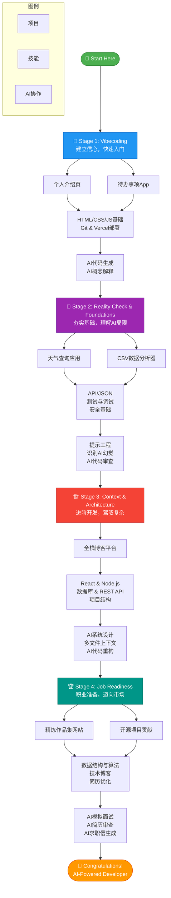

# 🗺️ 统一学习路线 (Gemini版)

**欢迎来到 AI 编程时代！这条路线图将指导你从零开始，在 AI 的辅助下，用大约 24 周成长为具有职场竞争力的开发者。**

与传统学习路径不同，我们把「与 AI 高效协作」作为核心能力来培养，AI 不只是问答工具，更是结对搭档、代码审查员与架构顾问。

:::tip 核心理念
- **项目驱动**：在真实项目中学习，而不是单纯记忆理论。
- **AI 协作**：把 AI 当作你的 Pair Programmer，与它共同完成任务。
- **快速迭代**：快速构建、快速失败、快速总结。
:::

---

## 📍 四阶段学习路径

我们将整个学习过程拆分为四个阶段，每个阶段都包含明确目标、关键技能与实践项目。

---

## 🚀 Stage 1: Vibecoding（第 1-3 周）

**目标：** 借助 AI 快速构建可见成果，消除“我不会编程”的恐惧。

| 项目 | 核心技能 | AI 协作技巧 |
|------|----------|--------------|
| 个人介绍页面 | HTML、CSS 基础，部署到 Vercel | 让 AI 生成页面结构并讲解样式含义 |
| 待办事项应用 | JavaScript、DOM、localStorage | 请 AI 生成 CRUD 逻辑，再手动复述与调试 |

**工具推荐**：Cursor / Replit、Git + GitHub、Vercel、ChatGPT / Claude。

**里程碑**：部署至少 1 个上线项目；完成首次 `git commit`；能用自然语言向 AI 描述需求。

---

## 🧠 Stage 2: Reality Check & Foundations（第 4-8 周）

**目标：** 夯实开发基础，认清 AI 的优势与局限，养成“信任但验证”的习惯。

| 项目 | 核心技能 | AI 协作技巧 |
|------|----------|--------------|
| 天气查询应用 | 第三方 API、JSON、异步编程 | 让 AI 解析文档、生成请求与错误处理 |
| CSV 数据分析器 | 文件处理、数据可视化 | 让 AI 进行代码审查并提示潜在 bug |

**关键练习**：
- 设计“AI 幻觉测试”题目，观察并纠正错误输出
- 学会撰写结构化 Prompt，与 AI 进行逐步对话
- 为 AI 生成的代码补充单元测试（Jest / Vitest）

**里程碑**：列出 3 个适合 / 不适合 AI 的任务；能独立调试 AI 生成的代码；掌握基础测试。

---

## 🏗️ Stage 3: Context & Architecture（第 9-16 周）

**目标：** 构建更复杂的全栈项目，掌握给 AI 提供长上下文、进行系统设计的能力。

| 项目 | 核心技能 | AI 协作技巧 |
|------|----------|--------------|
| 全栈博客平台 | React、Node.js、数据库、REST API | 与 AI 讨论数据库 schema、API 设计、组件拆分，使用 `.cursorrules` 规范回答 |

**核心任务**：
- 给 AI 完整的需求文档，让其输出架构图（Mermaid）
- 让 AI 生成项目骨架，并配合手动调整
- 使用 Cursor 等工具完成跨文件重构

**里程碑**：完成 1 个全栈项目；熟练处理多文件上下文；形成一份 AI 协助完成的架构文档。

---

## 🏆 Stage 4: Job Readiness（第 17-24 周及以后）

**目标：** 将成果转换为职业竞争力，准备求职与面试。

| 任务 | 核心技能 | AI 协作技巧 |
|------|----------|--------------|
| 作品集网站 | SEO、技术写作 | 让 AI 审校项目描述，使其更有说服力 |
| 开源项目贡献 | 阅读他人代码、协作流程 | 让 AI 帮你梳理大型代码库，定位适合的新手 issue |
| 面试准备 | 数据结构、算法、系统设计 | AI 模拟面试、审阅简历、生成求职信 |

**个人品牌建设**：撰写技术博客、优化 LinkedIn、选择一个方向深入精进。

**里程碑**：
- 搭建展示 6-8 个项目的作品集
- 向开源项目提交并合并至少 1 个 PR
- 能自信地通过 AI 模拟面试并复盘回答

---

## ✅ 避坑提示与成功指标

- **不要盲目复制粘贴**：理解、重写、测试 AI 给出的代码，才能真正吸收知识。
- **避免闭门造车**：积极在社区交流 AI 协作经验。
- **量化你的成长**：记录每周提交次数、项目进展、解决的 bug。

当你能稳定完成以上任务，并持续迭代作品与技能，就已经踏上 AI 驱动开发者的正轨。勇敢迈出第一步吧，下一阶段的你会感谢现在努力的自己！ 🚀
