import RoadmapAnalytics from '@site/src/components/RoadmapAnalytics';

<RoadmapAnalytics />

# 🗺️ 学习路线图 v1.1

**5-9 周时间，从零基础成长为 AI 驱动的开发者**

:::info v1.1 新增内容
✨ **增强版：AI 协作技巧**
- 🤖 每个级别都清晰说明"AI 如何帮助你"
- 💬 可直接复制使用的实用提示词
- 🎯 学习如何与 AI 协作，而不仅仅是使用工具
:::

这个路线图将你的学习分解为 **3 个阶段**中的 **12 个级别**，每一步都有动手实践的项目。每个级别都建立在前一个级别的基础上，所以你始终清楚下一步该做什么。

:::tip 预计时间
**总计 5-9 周**（每天 1-2 小时）
- Stage 0: 2-4 周
- Stage 1: 1-2 周
- Stage 2: 2-3 周
:::

---

## 📍 你在哪个位置？

不确定从哪里开始？使用这个快速指南：

| 如果你是... | 从这里开始 |
|---------------|------------|
| 👶 从未编程过 | **Stage 0, Level 0.1** - 今天就构建你的第一个网页 |
| 🎯 用 AI 做过几个项目 | **Stage 1, Level 1.1** - 了解 AI 做不到的事情 |
| 🏗️ 想要构建复杂应用 | **Stage 2, Level 2.1** - 掌握上下文与架构 |

---

## 📈 追踪你的进度

**推荐：** 使用 GitHub Projects 可视化你的学习旅程

**快速设置（5 分钟）：**
1. 在你的账户中创建一个新的 [GitHub Project](https://github.com/features/issues)
2. 添加 12 张卡片："Level 0.1"、"Level 0.2"、...、"Level 2.4"
3. 创建列："未开始" | "进行中" | "已完成"
4. 完成每个级别时移动卡片

**为什么这样做有效：**
- ✅ 可视化进度 = 增强动力
- ✅ 轻松与朋友或招聘者分享
- ✅ 与你的 GitHub 提交自然同步

**备选方案：** Notion 模板（即将推出）

:::tip 可选项
进度追踪是一个工具，而不是必须项。选择适合你的方式，或者完全跳过它。目标是学习，而不是打勾完成任务。
:::

---

## 🎮 完整学习路径

```mermaid
graph TB
    Start([👋 Start Here]) --> S0[🎮 Stage 0: Vibecoding<br/>消除恐惧，今天就编程]

    S0 --> L01[Level 0.1: 第一行代码<br/>Build first webpage]
    L01 --> L02[Level 0.2: 本地开发<br/>Setup local environment]
    L02 --> L03[Level 0.3: API 集成<br/>Connect to APIs]
    L03 --> L04[Level 0.4: 部署上线<br/>Deploy to production]
    L04 --> P0[🎯 Stage 0 Project<br/>Build mini project]

    P0 --> S1[🧠 Stage 1: Reality Check<br/>理解 AI 局限性]

    S1 --> L11[Level 1.1: AI 局限性<br/>Understand limitations]
    L11 --> L12[Level 1.2: 提示工程<br/>Advanced prompting]
    L12 --> L13[Level 1.3: 测试调试<br/>Testing & debugging]
    L13 --> L14[Level 1.4: 安全实践<br/>Security basics]

    L14 --> S2[🏗️ Stage 2: Context & Architecture<br/>掌握上下文与架构]

    S2 --> L21[Level 2.1: 项目结构<br/>Project organization]
    L21 --> L22[Level 2.2: 长上下文<br/>Multi-file editing]
    L22 --> L23[Level 2.3: 高级提示<br/>Advanced context]
    L23 --> L24[Level 2.4: 架构设计<br/>System design]
    L24 --> P2[🎯 Stage 2 Project<br/>Full-stack application]

    P2 --> End([🎉 Congratulations!<br/>AI-Powered Developer])

    style Start fill:#4CAF50,stroke:#2E7D32,color:#fff
    style End fill:#FF9800,stroke:#E65100,color:#fff
    style S0 fill:#2196F3,stroke:#1565C0,color:#fff
    style S1 fill:#9C27B0,stroke:#6A1B9A,color:#fff
    style S2 fill:#F44336,stroke:#C62828,color:#fff
    style P0 fill:#FFD700,stroke:#FFA000,color:#000
    style P2 fill:#FFD700,stroke:#FFA000,color:#000
```



---

## 🎮 Stage 0: Vibecoding（快乐编程）

**目标：** 消除恐惧，今天就开始编程
**时长：** 2-4 周（每天 1-2 小时）

### Level 0.1: 第一行代码

**你将学到：**
- 体验 AI 辅助编程的魔力
- 无需任何配置
- 建立信心："我可以编程！"

**项目：** 构建一个简单的个人介绍网页（HTML + CSS）

#### 🤖 AI 如何帮助你

| 任务 | 你要做什么 | AI 如何帮助 |
|------|-------------|--------------|
| **学习概念** | 理解 HTML 标签 | **推荐（英文）：** "Explain HTML tags like \<h1\>, \<p\>, \<div\> using everyday analogies"<br/>**可选（中文）：** "用日常生活的类比解释 HTML 标签，比如 \<h1\>、\<p\>、\<div\>" |
| **生成代码** | 创建页面结构 | **推荐（英文）：** "Create a personal intro page with semantic HTML: profile photo, name, bio, skill tags"<br/>**可选（中文）：** "创建一个个人介绍页面，使用语义化 HTML：包含头像、姓名、简介、技能标签" |
| **样式设计** | 应用 CSS 样式 | **推荐（英文）：** "Use Flexbox to center all content vertically and horizontally"<br/>**可选（中文）：** "使用 Flexbox 将所有内容垂直和水平居中" |
| **调试问题** | 修复布局错误 | **推荐（英文）：** "My div isn't centering. Here's my CSS: [code]. What's wrong?"<br/>**可选（中文）：** "我的 div 没有居中显示。这是我的 CSS：[代码]。哪里出错了？" |
| **学习最佳实践** | 编写整洁代码 | **推荐（英文）：** "Review my HTML for accessibility and semantic structure"<br/>**可选（中文）：** "检查我的 HTML 的可访问性和语义化结构" |

#### 💡 提示词示例

**学习概念：**
```
推荐（英文）：
Explain CSS Flexbox like I'm 10 years old.
Use everyday analogies (like organizing toys in a box).
Give me 3 simple examples I can try.

可选（中文）：
用给 10 岁孩子讲解的方式解释 CSS Flexbox。
使用日常生活类比（比如在盒子里整理玩具）。
给我 3 个简单的示例让我尝试。
```

**生成代码：**
```
推荐（英文）：
Create a personal introduction webpage using HTML and CSS.

Requirements:
- Semantic HTML5 structure
- Profile photo (use placeholder image)
- Name as h1
- One-paragraph bio
- 3 skill tags (like badges)
- Center everything using Flexbox
- Clean, minimal design

Add comments explaining each section.
Don't use any frameworks - just HTML + CSS.

可选（中文）：
使用 HTML 和 CSS 创建一个个人介绍网页。

要求：
- 使用 HTML5 语义化结构
- 个人头像（使用占位符图片）
- 姓名使用 h1 标签
- 一段个人简介
- 3 个技能标签（类似徽章）
- 使用 Flexbox 居中所有内容
- 简洁、简约的设计

添加注释解释每个部分。
不要使用任何框架——只用 HTML + CSS。
```

**调试：**
```
推荐（英文）：
My personal intro page has a problem: the profile photo is too large
and pushing other elements off-screen.

Here's my HTML:
[paste code]

Here's my CSS:
[paste code]

Please:
1. Identify the problem
2. Give me the fix
3. Explain why this happened (so I can avoid it next time)

可选（中文）：
我的个人介绍页面有个问题：头像太大了，
把其他元素挤出了屏幕。

这是我的 HTML：
[粘贴代码]

这是我的 CSS：
[粘贴代码]

请：
1. 找出问题所在
2. 给我修复方案
3. 解释为什么会这样（让我下次避免）
```

**工具：**
- [Replit AI](https://replit.com)（免费）- 在线 IDE，内置 AI 助手
- [ChatGPT](https://chatgpt.com)（免费版）- 解释代码和回答问题
- 备选方案：[v0.dev](https://v0.dev)（生成 UI 组件）

**资源：**
- [Replit: Build with AI Tutorial](https://replit.com/learn)
- [Fireship: 10 web apps with AI (14 min)](https://www.youtube.com/watch?v=UG3YC_jqPDg)
- [HTML in 100 Seconds](https://youtu.be/ok-plXXHlWw) - 快速概览

**检查点：**
- ✅ 发布了你的第一个网页（有在线 URL）
- ✅ 用 AI 修改了代码并看到了效果
- ✅ 能用自然语言描述你想要的东西
- ✅ 理解基本的 HTML 结构和 CSS 样式

**预计时间：** 2-3 天

:::tip 💡 专业提示
不要只是复制 AI 代码！手动输入它，改变一些值，看看会出什么问题。通过实验才能真正学会。
:::

---

### Level 0.2: 本地开发

**你将学到：**
- 安装本地开发环境
- 理解文件、文件夹、编辑器
- 使用专业工具（保持简单）
- Git 版本控制基础

**项目：** 在本地构建一个待办事项应用（HTML、CSS、JavaScript，使用 localStorage）

#### 🤖 AI 如何帮助你

| 任务 | 你要做什么 | AI 如何帮助 |
|------|-------------|--------------|
| **工具设置** | 安装 Cursor/VS Code | **推荐（英文）：** "Guide me through installing Cursor step-by-step for a complete beginner"<br/>**可选（中文）：** "为完全的初学者一步步指导如何安装 Cursor" |
| **学习 JavaScript** | 理解变量、函数 | **推荐（英文）：** "Explain JavaScript variables and functions with a to-do list example"<br/>**可选（中文）：** "用待办事项列表的例子解释 JavaScript 变量和函数" |
| **DOM 操作** | 从页面添加/删除任务 | **推荐（英文）：** "How do I add a new item to an HTML list when user clicks a button?"<br/>**可选（中文）：** "当用户点击按钮时，如何向 HTML 列表添加新项目？" |
| **数据持久化** | 将任务保存到 localStorage | **推荐（英文）：** "Explain localStorage with code examples for saving/loading a to-do list"<br/>**可选（中文）：** "用代码示例解释 localStorage，展示如何保存/加载待办事项列表" |
| **Git 基础** | 提交和推送代码 | **推荐（英文）：** "Teach me Git basics: what do init, add, commit, and push do?"<br/>**可选（中文）：** "教我 Git 基础：init、add、commit 和 push 分别做什么？" |
| **调试 JavaScript** | 修复"undefined"错误 | **推荐（英文）：** "I'm getting 'Cannot read property of undefined'. Here's my code: [code]"<br/>**可选（中文）：** "我遇到了'无法读取 undefined 的属性'错误。这是我的代码：[代码]" |

#### 💡 提示词示例

**工具安装：**
```
推荐（英文）：
I'm a complete beginner. Guide me through installing Cursor IDE:
1. Where to download
2. Installation steps for [Mac/Windows/Linux]
3. First-time setup recommendations
4. How to create my first project

Explain each step clearly.

可选（中文）：
我是完全的初学者。指导我安装 Cursor IDE：
1. 从哪里下载
2. [Mac/Windows/Linux] 的安装步骤
3. 首次设置建议
4. 如何创建我的第一个项目

清楚地解释每一步。
```

**学习 JavaScript：**
```
推荐（英文）：
I know HTML/CSS but not JavaScript. Teach me:
1. Variables (let, const)
2. Functions
3. Event listeners (onclick)
4. DOM manipulation (getElementById, querySelector)

Use a to-do list app as the teaching example.
Give me code I can try immediately.

可选（中文）：
我懂 HTML/CSS 但不懂 JavaScript。教我：
1. 变量（let、const）
2. 函数
3. 事件监听器（onclick）
4. DOM 操作（getElementById、querySelector）

用待办事项应用作为教学例子。
给我可以立即尝试的代码。
```

**构建功能：**
```
推荐（英文）：
Help me build a to-do list app feature by feature.

Current task: Add new todo item
Requirements:
- Input field for task text
- "Add" button
- When clicked, add item to list below
- Clear input after adding

Give me:
1. HTML structure
2. CSS (basic styling)
3. JavaScript with detailed comments
4. Explanation of how it works

可选（中文）：
帮我逐个功能构建待办事项应用。

当前任务：添加新的待办事项
要求：
- 任务文本的输入框
- "添加"按钮
- 点击后，将项目添加到下面的列表
- 添加后清空输入框

给我：
1. HTML 结构
2. CSS（基础样式）
3. 带详细注释的 JavaScript
4. 工作原理的解释
```

**调试：**
```
推荐（英文）：
My to-do app isn't working. When I click "Add", nothing happens.

Here's my HTML:
[paste code]

Here's my JavaScript:
[paste code]

Console shows no errors. What am I missing?

Please:
1. Find the bug
2. Explain why it's not working
3. Give me the fixed code
4. Teach me how to debug this myself next time

可选（中文）：
我的待办应用不工作。当我点击"添加"时，什么都没发生。

这是我的 HTML：
[粘贴代码]

这是我的 JavaScript：
[粘贴代码]

控制台没有显示错误。我遗漏了什么？

请：
1. 找到 bug
2. 解释为什么不工作
3. 给我修复后的代码
4. 教我下次如何自己调试
```

**Git 工作流：**
```
推荐（英文）：
I've finished my to-do app. Teach me Git:
1. How to create a GitHub account
2. Initialize Git in my project folder
3. Make my first commit
4. Push to GitHub
5. View my code online

Step-by-step commands with explanations.

可选（中文）：
我完成了待办应用。教我 Git：
1. 如何创建 GitHub 账户
2. 在项目文件夹中初始化 Git
3. 进行第一次提交
4. 推送到 GitHub
5. 在线查看我的代码

逐步的命令和解释。
```

**工具：**
- [Cursor](https://cursor.com)（免费版）- 最适合初学者的 AI 编辑器
- 备选方案：[VS Code](https://code.visualstudio.com) + [GitHub Copilot](https://github.com/features/copilot)
- [Git](https://git-scm.com) + [GitHub](https://github.com)（版本控制入门）

**资源：**
- [Cursor IDE Tutorial for Beginners (25 min)](https://www.youtube.com/watch?v=4q0ekTZqZZM)
- [Build a Todo App with AI (30 min)](https://www.youtube.com/watch?v=NgX5qxSwUFg)
- [Cursor Quickstart Guide](https://docs.cursor.com/get-started/migrate-from-vscode)
- [JavaScript in 100 Seconds](https://youtu.be/DHjqpvDnNGE)

**检查点：**
- ✅ Cursor 或 VS Code 已安装并运行
- ✅ 完成了带有添加/删除功能的待办应用
- ✅ 任务在页面重新加载后保持（localStorage）
- ✅ 代码已提交到 GitHub（首次版本控制体验）
- ✅ 理解基本的 JavaScript 和 DOM 操作

**预计时间：** 4-5 天

:::warning ⚠️ 常见错误
不要跳过 Git！从第一天就开始提交。未来的你会感谢现在的你。
:::

---

### Level 0.3: API 集成

**你将学到：**
- 理解前端与后端的关系
- 调用第三方 API
- 处理异步操作（async/await）
- 处理 JSON 数据
- 优雅地处理错误

**项目：** 构建以下之一（你的选择）：
- **天气查询应用**（推荐初学者）
- Discord 机器人
- Chrome 扩展

#### 🤖 AI 如何帮助你

| 任务 | 你要做什么 | AI 如何帮助 |
|------|-------------|--------------|
| **理解 API** | 学习什么是 API | **推荐（英文）：** "Explain APIs like I'm 5. Use restaurant ordering as an analogy"<br/>**可选（中文）：** "像给 5 岁孩子讲解一样解释 API。用餐厅点餐作为类比" |
| **阅读 API 文档** | 浏览文档 | **推荐（英文）：** "Explain OpenWeatherMap API docs. What do I need to get weather data?"<br/>**可选（中文）：** "解释 OpenWeatherMap API 文档。我需要什么才能获取天气数据？" |
| **API 认证** | 获取和使用 API 密钥 | **推荐（英文）：** "How do I safely use API keys? What's .env and why do I need it?"<br/>**可选（中文）：** "如何安全使用 API 密钥？.env 是什么，为什么需要它？" |
| **调用 API** | 使用 fetch() 或 axios | **推荐（英文）：** "Show me how to call OpenWeatherMap API with fetch(). Include error handling"<br/>**可选（中文）：** "展示如何用 fetch() 调用 OpenWeatherMap API。包括错误处理" |
| **解析 JSON** | 从响应中提取数据 | **推荐（英文）：** "Parse this JSON and extract temperature: [paste API response]"<br/>**可选（中文）：** "解析这个 JSON 并提取温度：[粘贴 API 响应]" |
| **异步 JavaScript** | 理解 promise | **推荐（英文）：** "Explain async/await with a weather app example. Why do I need it?"<br/>**可选（中文）：** "用天气应用的例子解释 async/await。为什么需要它？" |
| **错误处理** | 处理失败的请求 | **推荐（英文）：** "My API call fails when city not found. How to handle this gracefully?"<br/>**可选（中文）：** "当找不到城市时我的 API 调用失败。如何优雅地处理？" |

#### 💡 提示词示例

**理解 API：**
```
推荐（英文）：
I'm new to APIs. Explain:
1. What is an API?
2. How does a weather API work?
3. What are API keys and why do I need them?
4. What is JSON and how do I read it?

Use simple language and examples I can relate to.

可选（中文）：
我是 API 新手。解释：
1. 什么是 API？
2. 天气 API 如何工作？
3. 什么是 API 密钥，为什么需要它们？
4. 什么是 JSON，如何阅读它？

使用简单的语言和我能理解的例子。
```

**入门：**
```
推荐（英文）：
I want to build a weather app that shows current weather for any city.

Guide me through:
1. Sign up for OpenWeatherMap API (free tier)
2. Get my API key
3. Make my first API call (just in browser console)
4. Understand the response

Give me exact steps and code examples.

可选（中文）：
我想构建一个显示任意城市当前天气的天气应用。

指导我完成：
1. 注册 OpenWeatherMap API（免费版）
2. 获取我的 API 密钥
3. 进行第一次 API 调用（就在浏览器控制台）
4. 理解响应

给我确切的步骤和代码示例。
```

**构建功能：**
```
推荐（英文）：
Build a weather app feature by feature.

Current feature: Search by city name

Requirements:
- Input field for city name
- "Search" button
- Display: city name, temperature, weather description, icon
- Show "City not found" error if invalid

Use OpenWeatherMap API: api.openweathermap.org/data/2.5/weather

Give me:
1. HTML structure
2. JavaScript with fetch()
3. Error handling
4. Comments explaining each part

可选（中文）：
逐个功能构建天气应用。

当前功能：按城市名称搜索

要求：
- 城市名称的输入框
- "搜索"按钮
- 显示：城市名称、温度、天气描述、图标
- 如果无效显示"找不到城市"错误

使用 OpenWeatherMap API：api.openweathermap.org/data/2.5/weather

给我：
1. HTML 结构
2. 带 fetch() 的 JavaScript
3. 错误处理
4. 解释每部分的注释
```

**调试异步代码：**
```
推荐（英文）：
My weather app shows "undefined" for temperature.

Here's my code:
[paste code]

The API call seems to work (I see data in console),
but I can't display it on the page.

What's wrong with my async handling?

可选（中文）：
我的天气应用显示温度为"undefined"。

这是我的代码：
[粘贴代码]

API 调用似乎工作了（我在控制台看到数据），
但我无法在页面上显示它。

我的异步处理哪里出错了？
```

**保护 API 密钥：**
```
推荐（英文）：
I want to deploy my weather app but I hear I shouldn't expose my API key.

Teach me:
1. Why API keys need protection
2. What is a .env file?
3. How to use environment variables
4. How to deploy with hidden API keys (Vercel/Netlify)

Give me step-by-step instructions.

可选（中文）：
我想部署天气应用，但听说不应该暴露 API 密钥。

教我：
1. 为什么 API 密钥需要保护
2. .env 文件是什么？
3. 如何使用环境变量
4. 如何部署时隐藏 API 密钥（Vercel/Netlify）

给我逐步说明。
```

**工具：**
- Cursor + AI Chat（解释 API 文档）
- [Postman](https://www.postman.com) / [Thunder Client](https://www.thunderclient.com)（测试 API）
- **免费 API：**
  - [OpenWeatherMap](https://openweathermap.org/api)（天气）
  - [Discord API](https://discord.com/developers/docs)（机器人）
  - [Chrome Extensions API](https://developer.chrome.com/docs/extensions)（扩展）

**资源：**
- [Create Your First Discord Bot with AI (20 min)](https://www.youtube.com/watch?v=hoDLj0IzZMU)
- [ChatGPT for Coding: Complete Guide (45 min)](https://www.youtube.com/watch?v=jRAAaDll34Q)
- [Async JavaScript in 100 Seconds](https://youtu.be/vn3tm0quoqE)

**检查点：**
- ✅ 成功调用了至少一个外部 API
- ✅ 能够处理和显示 API 数据
- ✅ 理解基本的 async/await 用法
- ✅ 优雅地处理错误（无效输入、网络故障）
- ✅ 保护了 API 密钥（不在公开的 GitHub 仓库中）

**预计时间：** 5-7 天

:::danger 🚨 关键
永远不要将 API 密钥提交到 GitHub！使用 `.env` 文件并将其添加到 `.gitignore`。
:::

---

### Level 0.4: 部署上线

**你将学到：**
- 让你的作品对全世界可见
- 理解前端部署流程
- 配置自定义域名
- 在生产环境中使用环境变量
- 从分享你的创作中获得满足感

**项目：** 将你之前的一个项目部署到生产环境（推荐天气应用）

#### 🤖 AI 如何帮助你

| 任务 | 你要做什么 | AI 如何帮助 |
|------|-------------|--------------|
| **选择平台** | 选择部署服务 | **推荐（英文）：** "Compare Vercel vs Netlify vs GitHub Pages for beginners. Which should I use?"<br/>**可选（中文）：** "为初学者比较 Vercel、Netlify 和 GitHub Pages。我应该用哪个？" |
| **部署设置** | 配置构建设置 | **推荐（英文）：** "Guide me through deploying to Vercel step-by-step"<br/>**可选（中文）：** "一步步指导我部署到 Vercel" |
| **环境变量** | 设置生产环境密钥 | **推荐（英文）：** "How do I add environment variables to Vercel for my API keys?"<br/>**可选（中文）：** "如何为我的 API 密钥在 Vercel 添加环境变量？" |
| **自定义域名** | 连接个人域名 | **推荐（英文）：** "I bought example.com. How do I connect it to my Vercel site?"<br/>**可选（中文）：** "我买了 example.com。如何将它连接到我的 Vercel 站点？" |
| **调试部署** | 修复构建失败 | **推荐（英文）：** "My Vercel build fails with [error]. Here's my setup: [details]"<br/>**可选（中文）：** "我的 Vercel 构建失败，错误是 [错误]。这是我的设置：[详情]" |
| **监控站点** | 检查性能 | **推荐（英文）：** "How do I know if my deployed site is working properly?"<br/>**可选（中文）：** "如何知道我部署的站点是否正常工作？" |

#### 💡 提示词示例

**选择平台：**
```
推荐（英文）：
I want to deploy my weather app (HTML/CSS/JS).

Compare these for me:
- Vercel
- Netlify
- GitHub Pages

Which is:
- Easiest for beginners?
- Supports environment variables?
- Has free HTTPS?
- Best for learning?

Recommend one and explain why.

可选（中文）：
我想部署我的天气应用（HTML/CSS/JS）。

为我比较这些：
- Vercel
- Netlify
- GitHub Pages

哪个：
- 最适合初学者？
- 支持环境变量？
- 有免费 HTTPS？
- 最适合学习？

推荐一个并解释原因。
```

**部署演示：**
```
推荐（英文）：
Deploy my weather app to Vercel step-by-step.

Current setup:
- Project in GitHub repo
- Uses OpenWeatherMap API (key in .env file)
- Pure HTML/CSS/JavaScript (no framework)

Guide me through:
1. Creating Vercel account
2. Connecting GitHub repo
3. Configuring build settings
4. Adding environment variables
5. First deployment
6. Checking if it works

Explain each step clearly.

可选（中文）：
一步步将我的天气应用部署到 Vercel。

当前设置：
- 项目在 GitHub 仓库中
- 使用 OpenWeatherMap API（密钥在 .env 文件中）
- 纯 HTML/CSS/JavaScript（无框架）

指导我完成：
1. 创建 Vercel 账户
2. 连接 GitHub 仓库
3. 配置构建设置
4. 添加环境变量
5. 首次部署
6. 检查是否工作

清楚地解释每一步。
```

**处理环境变量：**
```
推荐（英文）：
My weather app works locally but fails in production.
Error: "API key is undefined"

I have API_KEY in .env file locally.

How do I:
1. Access this environment variable in my JavaScript?
2. Set it in Vercel dashboard?
3. Verify it's working?

Give me exact code and settings.

可选（中文）：
我的天气应用在本地工作但在生产环境失败。
错误："API 密钥未定义"

我本地有 .env 文件中的 API_KEY。

我如何：
1. 在 JavaScript 中访问这个环境变量？
2. 在 Vercel 仪表板中设置它？
3. 验证它是否工作？

给我确切的代码和设置。
```

**自定义域名设置：**
```
推荐（英文）：
I bought my-weather-app.com and want to use it for my Vercel site.

Teach me:
1. What DNS records are
2. How to configure my domain registrar
3. How to add domain in Vercel
4. How long does it take?
5. How to troubleshoot if it doesn't work?

Assume I know nothing about domains.

可选（中文）：
我买了 my-weather-app.com，想用它作为我的 Vercel 站点。

教我：
1. 什么是 DNS 记录
2. 如何配置我的域名注册商
3. 如何在 Vercel 添加域名
4. 需要多长时间？
5. 如果不工作如何排查？

假设我对域名一无所知。
```

**调试部署：**
```
推荐（英文）：
My Vercel deployment failed with this error:
[paste error log]

My project structure:
- index.html
- style.css
- script.js
- .env (for API key)

What's wrong and how do I fix it?

可选（中文）：
我的 Vercel 部署失败，错误是：
[粘贴错误日志]

我的项目结构：
- index.html
- style.css
- script.js
- .env（用于 API 密钥）

哪里出错了，如何修复？
```

**工具：**
- [Vercel](https://vercel.com)（推荐）- 零配置部署，自动 HTTPS
- [Netlify](https://netlify.com)（备选方案）
- [GitHub Pages](https://pages.github.com)（用于静态站点，无服务器端密钥）

**资源：**
- [Deploy to Vercel in 5 Minutes](https://vercel.com/docs/getting-started-with-vercel)
- [Netlify Deployment Tutorial](https://docs.netlify.com/get-started/)
- [GitHub Pages Guide](https://pages.github.com/)

**检查点：**
- ✅ 项目已部署，有公开 URL
- ✅ 理解 Git push → 自动部署工作流
- ✅ 环境变量正确配置
- ✅ HTTPS 自动启用
- ✅ 可以与朋友/社区分享项目链接
- ✅ 站点加载快速，在移动设备上工作

**预计时间：** 2-3 天

:::tip 💡 专业提示
尽早部署，经常部署。不要等待"完美"——发布它，获取反馈，迭代。
:::

---

### 🎯 Stage 0 毕业项目

**要求：** 选择你的方向，完成一个迷你项目（2-3 天）

**示例方向：**
- **Web 应用：** 个人博客、作品集网站、实用工具
- **机器人/自动化：** Telegram 机器人、数据爬虫、自动化脚本
- **创意：** 简单游戏、数据可视化、音乐播放器

#### 🤖 AI 如何帮助你

| 阶段 | 你要做什么 | AI 如何帮助 |
|-------|-------------|--------------|
| **规划** | 选择项目范围 | **推荐（英文）：** "I want to build [idea]. Break it down into 3-5 manageable features for a beginner"<br/>**可选（中文）：** "我想构建 [想法]。将它分解为初学者可管理的 3-5 个功能" |
| **架构** | 设计结构 | **推荐（英文）：** "Design file structure for [project]. List all files I need and what each does"<br/>**可选（中文）：** "为 [项目] 设计文件结构。列出我需要的所有文件以及每个文件的作用" |
| **实现** | 构建功能 | **推荐（英文）：** "Implement [feature]. Guide me step-by-step with code examples"<br/>**可选（中文）：** "实现 [功能]。用代码示例一步步指导我" |
| **集成** | 连接各部分 | **推荐（英文）：** "I have [module A] and [module B]. How do I make them work together?"<br/>**可选（中文）：** "我有 [模块 A] 和 [模块 B]。如何让它们一起工作？" |
| **润色** | 改进 UX/UI | **推荐（英文）：** "Review my project's UX. Suggest 3 improvements for better user experience"<br/>**可选（中文）：** "审查我项目的用户体验。建议 3 个改进以获得更好的用户体验" |
| **文档** | 编写 README | **推荐（英文）：** "Generate a README for my project. Include: setup, usage, screenshots, tech stack"<br/>**可选（中文）：** "为我的项目生成 README。包括：设置、使用、截图、技术栈" |

#### 💡 项目规划提示词

```
推荐（英文）：
I want to build a [project idea] as my Stage 0 graduation project.

Help me plan:

1. **Feasibility Check**
   - Is this appropriate for a beginner who just finished Stage 0?
   - What skills from Stage 0 will I use?
   - What new things will I learn?

2. **Feature Breakdown**
   - Core features (must-have)
   - Nice-to-have features
   - What to skip for v1

3. **Technical Stack**
   - HTML/CSS/JavaScript enough? Or do I need something else?
   - What APIs or libraries should I consider?
   - Any potential blockers?

4. **Timeline**
   - Realistic completion time for 2-3 hours/day?
   - Day-by-day plan

Be honest if my idea is too ambitious. Suggest a simpler version if needed.

可选（中文）：
我想构建一个 [项目想法] 作为我的 Stage 0 毕业项目。

帮我规划：

1. **可行性检查**
   - 这对于刚完成 Stage 0 的初学者合适吗？
   - 我将使用 Stage 0 的哪些技能？
   - 我会学到什么新东西？

2. **功能分解**
   - 核心功能（必须有）
   - 很好有的功能
   - v1 版本应该跳过什么

3. **技术栈**
   - HTML/CSS/JavaScript 够用吗？还是需要别的？
   - 我应该考虑什么 API 或库？
   - 有什么潜在的障碍？

4. **时间线**
   - 每天 2-3 小时的实际完成时间？
   - 每日计划

如果我的想法太宏大，请诚实告诉我。如果需要，建议一个更简单的版本。
```

**评估标准：**
- ✅ 代码托管在 GitHub
- ✅ 有基本的 README 文档
- ✅ 部署到生产环境（如适用）
- ✅ 在社区或与朋友分享
- ✅ 展示了所有 4 个级别的技能

**预计时间：** 2-3 天

:::note 📝 展示你的作品
在社交媒体上用 #AICodeLearner 标签标记你的项目！分享你的学习旅程。
:::

---

## 🎉 恭喜！Stage 0 完成

你刚刚在 2-4 周内学会了用 AI 编程。接下来做什么？**选择权在你手中。**

### 🎯 选择你的道路

**选项 A：继续 Web 开发**
你喜欢构建 Web 项目。让我们深入学习。
→ 继续到 [Stage 1](/docs/roadmap#-stage-1-reality-check)（React、API、数据库）

**选项 B：探索计算机科学理论**
你想了解底层工作原理。
→ [CS50 (Harvard)](https://cs50.harvard.edu) | [MIT OpenCourseWare](https://ocw.mit.edu) | [freeCodeCamp](https://freecodecamp.org)

**选项 C：将编程应用到你的领域**
你想在现有领域中使用编程：
- **数据科学：** [Python for Data Analysis](https://www.oreilly.com/library/view/python-for-data/9781491957653/) | [Kaggle Learn](https://www.kaggle.com/learn)
- **设计：** [Frontend Masters](https://frontendmasters.com) | [CSS-Tricks](https://css-tricks.com)
- **营销：** [Zapier Automation](https://zapier.com/learn) | [Google Analytics API](https://developers.google.com/analytics)
- **研究：** [Jupyter Notebooks](https://jupyter.org/try) | [matplotlib tutorials](https://matplotlib.org/stable/tutorials/index.html)

**选项 D：像专业人士一样使用 AI 工具**
你只想有效地使用 AI 工具：
→ [Cursor Tips & Tricks](https://cursor.sh/docs) | [GitHub Copilot Guide](https://docs.github.com/copilot) | [Prompt Engineering 101](/docs/prompt-engineering-101)

**没有错误的选择！** 路线图激发了你的兴趣。现在探索让你兴奋的东西。

:::tip 可选反馈
[告诉我们你选择了哪条道路](https://forms.gle/placeholder)（1 分钟，帮助我们改进）
:::

---

## 🎓 Stage 0 完成 - 你的成就

恭喜！你已经完成了 Stage 0 🎉

**你现在可以：**
- ✅ 从零开始构建和部署网页
- ✅ 有效使用 AI 学习和生成代码
- ✅ 掌握 HTML、CSS 和 JavaScript 基础
- ✅ 调用 API 并处理异步操作
- ✅ 使用 Git 和 GitHub 进行版本控制
- ✅ 将项目部署到生产环境

**目前的作品集：**
- 个人介绍页面
- 带 localStorage 的待办事项应用
- 天气应用（或 Discord 机器人/Chrome 扩展）
- 毕业项目
- 全部托管在 GitHub 上，有在线演示

**下一步：**
准备好了解 AI 的局限性并成为批判性思考者了吗？继续到 **[Stage 1: Reality Check →](/docs/roadmap#-stage-1-reality-check)**

---

*其余阶段（Stage 1 和 2）将在下次更新中增强 AI 协作技巧。目前，请参考 [原始路线图](/docs/roadmap) 了解这些部分。*

---

**版本：** 1.1.0
**最后更新：** 2025-10-27
**更新日志：** 为 Stage 0 添加了 AI 协作技巧和详细提示词
