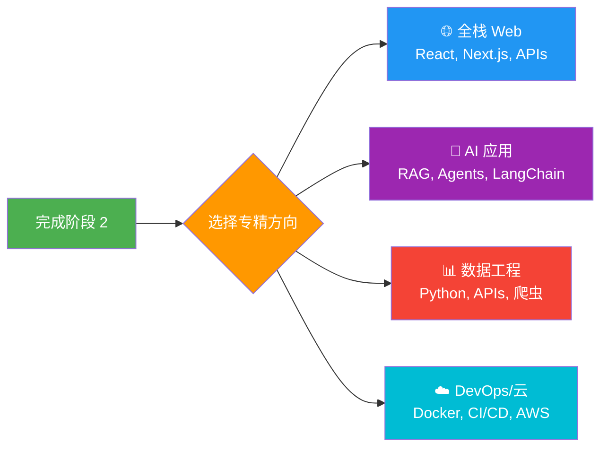

# 学习路线图

**5-9 周内从零到 AI 驱动开发者**

本路线图将你的学习分为 **3 个阶段** 的 **12 个关卡**，每一步都有实战项目。每个关卡都建立在前一个基础上，所以你总能清楚地知道下一步该做什么。

:::tip 预计时间
**总计 5-9 周**（每天 1-2 小时）
- 阶段 0：2-4 周
- 阶段 1：1-2 周
- 阶段 2：2-3 周
:::

---

## 你在哪里？

不确定从哪里开始？使用这个快速指南：

| 如果你... | 从这里开始 |
|-----------|-----------|
| 👶 从未编程过 | **阶段 0，关卡 0.1** - 今天就构建你的第一个网页 |
| 🎯 用 AI 做过几个项目 | **阶段 1，关卡 1.1** - 了解 AI 不能做什么 |
| 🏗️ 想构建复杂应用 | **阶段 2，关卡 2.1** - 掌握上下文与架构 |

---

## 完整学习路径

```mermaid
graph TB
    Start([👋 从这里开始]) --> S0[🎮 阶段 0: Vibecoding<br/>消除恐惧，今天就编程]

    S0 --> L01[关卡 0.1: 第一行代码<br/>构建第一个网页]
    L01 --> L02[关卡 0.2: 本地开发<br/>搭建本地环境]
    L02 --> L03[关卡 0.3: API 集成<br/>连接 API]
    L03 --> L04[关卡 0.4: 部署上线<br/>部署到生产环境]
    L04 --> P0[🎯 阶段 0 项目<br/>构建迷你项目]

    P0 --> S1[🧠 阶段 1: Reality Check<br/>理解 AI 局限性]

    S1 --> L11[关卡 1.1: AI 局限性<br/>了解局限]
    L11 --> L12[关卡 1.2: 提示工程<br/>高级提示技巧]
    L12 --> L13[关卡 1.3: 测试调试<br/>测试与调试]
    L13 --> L14[关卡 1.4: 安全实践<br/>安全基础]

    L14 --> S2[🏗️ 阶段 2: 上下文与架构<br/>掌握上下文与架构]

    S2 --> L21[关卡 2.1: 项目结构<br/>项目组织]
    L21 --> L22[关卡 2.2: 长上下文<br/>多文件编辑]
    L22 --> L23[关卡 2.3: 高级提示<br/>高级上下文]
    L23 --> L24[关卡 2.4: 架构设计<br/>系统设计]
    L24 --> P2[🎯 阶段 2 项目<br/>全栈应用]

    P2 --> End([🎉 恭喜！<br/>AI 驱动开发者])

    style Start fill:#4CAF50,stroke:#2E7D32,color:#fff
    style End fill:#FF9800,stroke:#E65100,color:#fff
    style S0 fill:#2196F3,stroke:#1565C0,color:#fff
    style S1 fill:#9C27B0,stroke:#6A1B9A,color:#fff
    style S2 fill:#F44336,stroke:#C62828,color:#fff
    style P0 fill:#FFD700,stroke:#FFA000,color:#000
    style P2 fill:#FFD700,stroke:#FFA000,color:#000
```

---

## 阶段 0: Vibecoding

**目标：** 消除恐惧，今天就开始编程
**时长：** 2-4 周（每天 1-2 小时）

### 关卡 0.1: 第一行代码

**你将学到：**
- 体验 AI 辅助编程的魔力
- 零配置即可开始
- 建立信心："我也能编程！"

**项目：** 构建一个简单的个人介绍网页（HTML + CSS）

**工具：**
- [Replit AI](https://replit.com)（免费）- 在线 IDE，内置 AI 助手
- [ChatGPT](https://chatgpt.com)（免费层）- 解释代码并回答问题
- 备选：[v0.dev](https://v0.dev)（生成 UI 组件）

**资源：**
- [Replit: Build with AI Tutorial](https://replit.com/learn)
- [Fireship: 10 web apps with AI (14 分钟)](https://www.youtube.com/watch?v=UG3YC_jqPDg)

**检查点：**
- ✅ 发布了你的第一个网页（在线 URL）
- ✅ 用 AI 修改了代码并看到了结果
- ✅ 能用自然语言描述你想要的功能

**预计时间：** 2-3 天

---

### 关卡 0.2: 本地开发

**你将学到：**
- 安装本地开发环境
- 理解文件、文件夹、编辑器的概念
- 使用专业工具（保持简单）

**项目：** 本地构建待办事项应用（HTML、CSS、JavaScript + localStorage）

**工具：**
- [Cursor](https://cursor.com)（免费层）- 最适合初学者的 AI 编辑器
- 备选：[VS Code](https://code.visualstudio.com) + [GitHub Copilot](https://github.com/features/copilot)
- [Git](https://git-scm.com) + [GitHub](https://github.com)（版本控制入门）

**资源：**
- [Cursor IDE Tutorial for Beginners (25 分钟)](https://www.youtube.com/watch?v=4q0ekTZqZZM)
- [Build a Todo App with AI (30 分钟)](https://www.youtube.com/watch?v=NgX5qxSwUFg)
- [Cursor Quickstart Guide](https://docs.cursor.com/get-started/migrate-from-vscode)

**检查点：**
- ✅ Cursor 或 VS Code 已安装并运行
- ✅ 完成的待办事项应用，具有添加/删除功能
- ✅ 代码已提交到 GitHub（第一次版本控制体验）

**预计时间：** 4-5 天

---

### 关卡 0.3: API 集成

**你将学到：**
- 理解前端与后端的关系
- 调用第三方 API
- 处理异步操作（async/await）

**项目：** 构建以下之一（你的选择）：
- 天气查询应用
- Discord 机器人
- Chrome 扩展

**工具：**
- Cursor + AI Chat（解释 API 文档）
- [Postman](https://www.postman.com) / [Thunder Client](https://www.thunderclient.com)（测试 API）
- **免费 API：** [OpenWeatherMap](https://openweathermap.org/api)、[Discord API](https://discord.com/developers/docs)、[Chrome Extensions API](https://developer.chrome.com/docs/extensions)

**资源：**
- [Create Your First Discord Bot with AI (20 分钟)](https://www.youtube.com/watch?v=hoDLj0IzZMU)
- [ChatGPT for Coding: Complete Guide (45 分钟)](https://www.youtube.com/watch?v=jRAAaDll34Q)

**检查点：**
- ✅ 成功调用了至少一个外部 API
- ✅ 能处理和显示 API 数据
- ✅ 理解 async/await 的基本用法

**预计时间：** 5-7 天

---

### 关卡 0.4: 部署上线

**你将学到：**
- 让全世界看到你的作品
- 理解前端部署流程
- 从分享创作中获得满足感

**项目：** 将你之前的项目之一部署到生产环境

**工具：**
- [Vercel](https://vercel.com)（推荐）- 零配置部署，自动 HTTPS
- [Netlify](https://netlify.com)（备选）
- [GitHub Pages](https://pages.github.com)（适用于静态网站）

**资源：**
- 教程：使用 AI 辅助部署（AI 生成部署配置）
- 教程：自定义域名设置
- 教程：使用环境变量保护 API 密钥

**检查点：**
- ✅ 项目已部署，有公开 URL
- ✅ 理解 Git push → 自动部署工作流
- ✅ 能与朋友/社区分享项目链接

**预计时间：** 2-3 天

---

### 阶段 0 毕业项目

**要求：** 选择你的方向，完成一个迷你项目（2-3 天）

**示例方向：**
- **Web 应用：** 个人博客、作品集网站、实用工具
- **机器人/自动化：** Telegram 机器人、数据爬虫、自动化脚本
- **创意项目：** 简单游戏、数据可视化、音乐播放器

**评估标准：**
- ✅ 代码托管在 GitHub 上
- ✅ 有基本的 README 文档
- ✅ 已部署到生产环境（如适用）
- ✅ 在社区或朋友圈分享了作品

**预计时间：** 2-3 天

:::tip 🎓 阶段 0 完成！接下来学什么？
恭喜完成 Vibecoding 阶段！接下来你将学习 AI 的真实能力边界。
**Congratulations on completing Stage 0! Next, you'll learn the true capabilities and limitations of AI.**

👉 准备好升级了吗？[继续阶段 1: Reality Check](#阶段-1-reality-check)
:::

---

## 阶段 1: Reality Check

**目标：** 理解 AI 局限性，培养批判性思维
**时长：** 1-2 周（每天 1-2 小时）

### 关卡 1.1: AI 的优势与局限

**你将学到：**
- 识别 AI 擅长的任务
- 识别 AI 容易出错的场景
- 理解"幻觉"（hallucination）现象

**项目：** 故意让 AI 犯错，然后修复

**任务清单：**
1. 让 AI 生成复杂算法（如排序），验证正确性
2. 给 AI 有 bug 的代码，看它是否能识别
3. 让 AI 生成安全相关代码（如用户认证），找出漏洞

**工具：**
- ChatGPT / Claude（对比不同模型的输出）
- [LLM Comparison Sites](https://lmarena.ai)

**资源：**
- [Andrej Karpathy on AI Coding](https://twitter.com/karpathy/status/1748863275736449258)
- [Simon Willison: Things I learned about LLMs](https://simonwillison.net/2023/Aug/3/weird-world-of-llms/)
- [When AI Coding Goes Wrong](https://github.com/facebookresearch/llm-hallucination-survey)

**检查点：**
- ✅ 能列举 3 个 AI 擅长的场景和 3 个容易出错的场景
- ✅ 成功识别并修复了 AI 生成的错误代码
- ✅ 理解为什么不能盲目信任 AI 输出

**预计时间：** 2-3 天

---

### 关卡 1.2: 提示工程进阶

**你将学到：**
- 掌握有效的提示词结构
- 学会拆解复杂任务为小步骤
- 使用 Few-Shot 和 Chain-of-Thought 技巧

**项目：** 使用更好的提示词重构阶段 0 的任一项目
- 对比：差提示词 vs 好提示词的输出质量

**工具：**
- Cursor Rules / `.cursorrules` 文件（项目级提示词配置）
- Prompt Libraries（如 PromptBase、Anthropic Prompt Library）

**资源：**
- [OpenAI's Prompt Engineering Guide](https://platform.openai.com/docs/guides/prompt-engineering)
- [GitHub Copilot Best Practices](https://github.blog/developer-skills/github/how-to-write-better-prompts-for-github-copilot/)
- [AI Coding Club: Prompt Engineering 101](/docs/prompt-engineering-101)

**检查点：**
- ✅ 能写出清晰、具体、富含上下文的提示词
- ✅ 理解 Few-Shot Learning 和 Chain-of-Thought
- ✅ 创建了自己的 `.cursorrules` 文件

**预计时间：** 2-3 天

---

### 关卡 1.3: 测试与调试

**你将学到：**
- 为 AI 生成的代码编写测试
- 使用 AI 辅助调试
- 理解"信任但验证"原则

**项目：** 为阶段 0 的项目添加单元测试
- 故意引入 bug，用 AI 辅助定位和修复

**工具：**
- [Jest](https://jestjs.io) / [Vitest](https://vitest.dev)（JavaScript 测试）
- [pytest](https://pytest.org)（Python 测试）
- AI Debugging：Cursor Debug 功能、ChatGPT 错误分析

**资源：**
- [Testing AI-Generated Code](https://martinfowler.com/articles/exploring-gen-ai.html)
- [The Danger of Trusting AI Code Blindly](https://blog.humphd.org/chasing-the-bear/)

**检查点：**
- ✅ 为至少 1 个项目编写了测试
- ✅ 能用 AI 辅助定位并修复 bug
- ✅ 理解"所有代码都需要验证"原则

**预计时间：** 3-4 天

---

### 关卡 1.4: 安全与最佳实践

**你将学到：**
- 识别 AI 生成代码中的安全隐患
- 理解常见安全漏洞（OWASP Top 10）
- 学会保护 API 密钥和敏感数据

**项目：** 对阶段 0 项目进行安全审计

**检查清单：**
1. API 密钥是否暴露？
2. 用户输入是否验证？
3. HTTPS 是否启用？
4. 依赖包是否有漏洞？

**工具：**
- [GitHub Dependabot](https://github.com/dependabot)（自动检测依赖漏洞）
- [Snyk](https://snyk.io) / `npm audit`（安全扫描）
- `.env` 文件（环境变量管理）

**资源：**
- [The False Promise of AI Coding Assistants](https://stackoverflow.blog/2024/06/10/generative-ai-is-not-going-to-build-your-engineering-team-for-you/)

**检查点：**
- ✅ 能识别 AI 代码中的 3 种常见安全问题
- ✅ 所有项目的 API 密钥已移至环境变量
- ✅ 理解"安全是持续的过程，不是一次性任务"

**预计时间：** 2-3 天

:::tip 💪 阶段 1 完成！准备好学习高级主题了吗？
你已经理解了 AI 的能力边界！现在让我们学习如何给 AI 提供最佳上下文。
**You now understand AI's boundaries! Let's learn how to provide optimal context to AI.**

👉 继续你的学习旅程：[阶段 2: 上下文与架构](#阶段-2-上下文与架构)
:::

---

## 阶段 2: 上下文与架构

**目标：** 掌握为 AI 提供上下文的技巧，设计 AI 友好的架构
**时长：** 2-3 周（每天 2-3 小时）

### 关卡 2.1: 项目结构设计

**你将学到：**
- 设计清晰的文件/文件夹结构
- 编写有效的 README 和文档
- 使用命名约定和代码组织模式

**项目：** 重构阶段 0 的任一项目，优化结构

**添加：**
- 清晰的文件夹层次结构（src/、tests/、docs/）
- 完整的 README（安装、使用、贡献指南）
- 代码注释和文档字符串

**工具：**
- AI Documentation Tools：Cursor 自动生成文档注释
- README Generators：[readme.so](https://readme.so)
- Project Templates：create-react-app、Vite 脚手架

**资源：**
- [Project Structure for AI Coding](https://github.com/Significant-Gravitas/AutoGPT/blob/master/docs/content/AutoGPT/setup.md)

**检查点：**
- ✅ 项目结构清晰，新人 5 分钟内能理解
- ✅ README 完整，包含所有必要信息
- ✅ 代码有适当的注释（不过度，不缺失）

**预计时间：** 3-4 天

---

### 关卡 2.2: 长上下文与多文件编辑

**你将学到：**
- 利用 AI 的长上下文窗口能力
- 跨多个文件进行重构
- 管理大型代码库

**项目：** 将小项目升级为中型项目（3+ 文件 → 10+ 文件）
- 使用 Cursor Composer 或类似工具进行多文件重构

**工具：**
- [Cursor Composer](https://docs.cursor.com/context/rules-for-ai)（多文件 AI 编辑）
- [Claude with Projects](https://claude.ai)（长上下文知识库）
- [Aider](https://aider.chat)（命令行 AI 编程工具）

**资源：**
- [Anthropic: Long Context Window Best Practices](https://docs.anthropic.com/en/docs/build-with-claude/prompt-engineering/long-context-tips)
- [Cursor Composer: Multi-File Editing Patterns](https://docs.cursor.com/context/rules-for-ai)

**检查点：**
- ✅ 成功完成了涉及 5+ 文件的重构
- ✅ 理解如何为 AI 提供项目级别的上下文
- ✅ 能管理中型项目（1000+ 行代码）

**预计时间：** 4-5 天

---

### 关卡 2.3: 提示工程高级技巧

**你将学到：**
- 掌握 Retrieval-Augmented Generation (RAG) 概念
- 使用 `.cursorrules` 和项目级配置
- 创建可复用的提示词模板

**项目：** 为项目创建自定义 AI 规则集
- 构建：个人提示词库

**工具：**
- `.cursorrules` 文件（Cursor 项目配置）
- [Anthropic Prompt Library](https://docs.anthropic.com/en/prompt-library/library)（提示词参考）
- [LangChain](https://www.langchain.com)（如需构建 RAG 应用）

**资源：**
- [Anthropic's Prompt Engineering Guide](https://docs.anthropic.com/en/docs/build-with-claude/prompt-engineering/overview)
- [LangChain Prompt Engineering](https://python.langchain.com/docs/modules/model_io/prompts/)

**检查点：**
- ✅ 创建了至少 1 个 `.cursorrules` 文件
- ✅ 有自己的提示词模板库（5+ 个模板）
- ✅ 理解 RAG 的基本概念

**预计时间：** 3-4 天

---

### 关卡 2.4: AI 驱动的架构设计

**你将学到：**
- 设计可扩展的应用架构
- 使用设计模式和最佳实践
- 平衡 AI 辅助与人工决策

**项目：** 从零设计一个完整的全栈应用（不必全部实现）

**输出：**
- 架构图（前端、后端、数据库、API）
- 技术选型文档（为什么选这些技术？）
- 文件结构规划

**工具：**
- AI Architecture Assistants：Claude、ChatGPT（讨论架构）
- Diagram Tools：Mermaid、Excalidraw、draw.io
- AI Code Review：Cursor 的代码审查功能

**资源：**
- [OpenAI Cookbook: Code Generation](https://cookbook.openai.com/)
- [GitHub: Awesome AI Coding](https://github.com/sourcegraph/awesome-ai-coding)

**检查点：**
- ✅ 完成了一个完整的架构设计文档
- ✅ 能解释为什么这样设计（trade-offs）
- ✅ 理解何时听 AI 建议，何时坚持人工判断

**预计时间：** 4-5 天

---

### 阶段 2 毕业项目

**要求：** 完整的中型项目（1-2 周）

**示例方向：**
- **全栈应用：** 博客系统（前端 + 后端 + 数据库）
- **AI 应用：** RAG 知识库问答系统
- **开发工具：** CLI 工具、VS Code 插件
- **API 服务：** RESTful API + 文档

**评估标准：**
- ✅ 架构清晰，有文档说明
- ✅ 代码结构良好，易于维护
- ✅ 有测试覆盖（至少核心功能）
- ✅ 已部署到生产环境
- ✅ 有完整的 README 和贡献指南

**预计时间：** 1-2 周

:::success 🎉 恭喜！你现在是一位 AI 驱动的开发者了！
恭喜你完成所有阶段！你已具备使用 AI 高效开发的核心能力。
**Congratulations on completing all stages! You now have the core skills to develop efficiently with AI.**

**接下来做什么？**
- 🌟 选择一个[专精路径](#可选技能树)来深化专业技能
- 💼 构建一个作品集项目来展示你的能力
- 🤝 加入我们的[社区讨论](https://github.com/IsaacZhaoo/aiCodingClub/discussions)与其他学习者交流
- 📚 探索我们的[完整课程](/docs/course/)获取结构化课程内容
:::

---

## 时间估算

| 阶段 | 关卡数 | 时长 | 每日投入 |
|------|--------|------|----------|
| 阶段 0: Vibecoding | 4 + 毕业项目 | 2-4 周 | 1-2 小时 |
| 阶段 1: Reality Check | 4 | 1-2 周 | 1-2 小时 |
| 阶段 2: 上下文与架构 | 4 + 毕业项目 | 2-3 周 | 2-3 小时 |
| **总计** | **12 关卡 + 2 项目** | **5-9 周** | **平均 2 小时/天** |

---

## 🌳 可选：技能树 {#可选技能树}

完成基础（阶段 0-2）后，你可以专精：

**选择你的专精方向：**
- 🌐 **全栈 Web 开发** - 构建生产级 Web 应用
- 🤖 **AI 应用开发** - RAG 系统、智能体、LangChain
- 📊 **数据工程** - 数据管道、分析、可视化
- ☁️ **DevOps 与云** - Docker、Kubernetes、CI/CD、AWS/Azure

---

## 学习技巧

### 1. 项目驱动学习
不要只看教程——构建真实项目。每个关卡都有实战项目来巩固你的学习。

### 2. 边学边改
拿 AI 生成的代码去实验。当你改变参数、添加功能或重构结构时会发生什么？

### 3. 社区支持
与其他学习者联系：
- 分享你的项目
- 提出问题
- 找学习伙伴
- 获得反馈

### 4. 不要急
可以在某个关卡花额外的时间。质量胜过速度。确保你理解了再继续。

### 5. 构建让你兴奋的东西
项目只是建议。如果你有一个你热衷的想法，就去构建它！热情 = 动力 = 更快的学习。

---

## 下一步

准备好开始了吗？前往 [阶段 0: Vibecoding](/docs/roadmap/stage0/)，今天就构建你的第一个项目！

---

**最后更新：** 2025-10-27
**路线图版本：** v1.0
